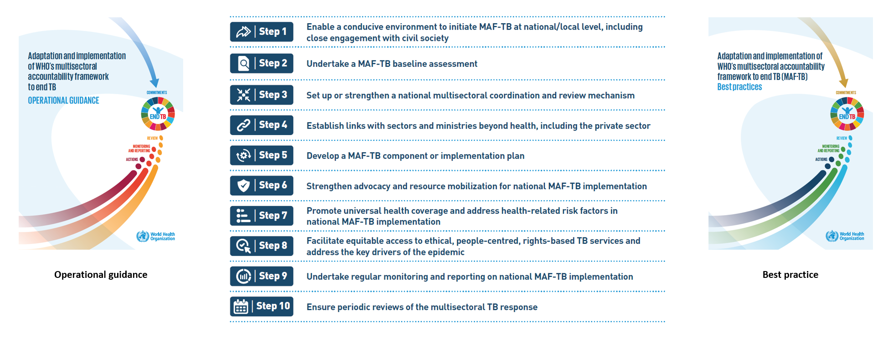

  
```{r setup, include=FALSE}

# Set chunk options.
# Results "asis" is needed to avoid xtable output being html encoded
# Suppress messages, warnings and also the ## at the beginning of printed text
# Set a default figure width too.

knitr::opts_chunk$set(echo = FALSE,
                      results = "asis",
                      message = FALSE,
                      warning = FALSE,
                      fig.width = 12)

# Load output packages ----
# - - - - - - - - - - - - - - - - - - - - - - - - - - - - - - - - - -
library(ggplot2)
library(ggrepel)
library(dplyr)
library(scales)
library(RColorBrewer)
library(whomap)
library(gtbreport)
library(here)

library(jsonlite)
library(dplyr)
library(here)
library(kableExtra)

# Load R functions ----
# - - - - - - - - - - - - - - - - - - - - - - - - - - - - - - - - - -
source(here("report/functions/html_links.R"))
source(here("report/functions/output_ggplot.R"))

# Get the data sets and computed values/statistics ----
# - - - - - - - - - - - - - - - - - - - - - - - - - - - - - - - - - - - 
source(here('report/ft_maf_prepare_data.r'))

# Show static chart in addition to Kendo chart?
show_static = F

# Save underlying data files as CSV and charts as PDF files?
pdf_csv_folder = here::here("report/local/figures/ft_maf")
save_csv = TRUE
save_pdf = TRUE

# Create the output folder (only if it doesn't yet exist)
dir.create(pdf_csv_folder, showWarnings = FALSE, recursive = TRUE)

```


```{r css_js}
# Add standard stylesheets and javascript to support kendo
cat(writeLines(readLines(here("report/resources/headers.htm"))))
```


```{css, echo=FALSE}
/* MAF table */
/* Recreating simple striped bootstrap table */
#maf_table {
  border-spacing: 0;
  border-collapse: collapse;
  margin-top: 1em;
  margin-bottom: 1em;
  /* Next two lines to allow horizontal scrolling on narrow screens */
  display: block;
  overflow-x: auto;
}

#maf_table th {
  background-color: #ADD8E6;
  border-bottom: 2px solid #DDDDDD;
  padding: 8px;
}

#maf_table td {
  border-top: 1px solid #DDDDDD;
  padding: 8px;
}

/* Bold for the final row with thick line above */
#maf_table tr:last-child td {
  border-top: 2px solid #DDDDDD;
  font-weight:bold;	
  background-color: #FBE4D5;
}

/* light gray when hovering over a row */
#maf_table tr:hover td {
  background-color: #DDDDDD;
}

/* Centre-align all column headings except for the first */
#maf_table th:not(:first-child) {
  text-align: center !important;
}

/* prevent numbers from wrapping in any of the columns */
#maf_table td {
  white-space: nowrap;
}


/* PPM table */
/* Recreating simple striped bootstrap table */
#ppm_table {
  border-spacing: 0;
  border-collapse: collapse;
  margin-top: 1em;
  margin-bottom: 1em;
  /* Next two lines to allow horizontal scrolling on narrow screens */
  display: block;
  overflow-x: auto;
}

#ppm_table th {
  background-color: #FFFFFF;	
  border-bottom: 2px solid #DDDDDD;
  padding: 8px;
}

#ppm_table td {
  background-color: #FFFFFF;	
  border-top: 1px solid #DDDDDD;
  padding: 8px;
}

/* light gray for odd rows */
#ppm_table tr:nth-child(odd) td {
  background-color: #F5F5F5;	
}


/* light gray when hovering over a row */
#ppm_table tr:hover td {
  background-color: #DDDDDD;
}

/* Centre-align all column headings except for the first */
#ppm_table th:not(:first-child) {
  text-align: center !important;
}

/* prevent numbers from wrapping in any of the columns */
#ppm_table td {
  white-space: nowrap;
}


```

# The World Health Organization multisectoral accountability framework to end TB (MAF-TB): progress and way forward 
 
<span class="red">**_Draft! Prepared `r Sys.Date()`` _**</span>  

Tuberculosis (TB) is strongly influenced by social and economic determinants. Factors such as poverty, undernourishment, and poor living and working conditions, among others, affect the risk of being infected with TB and, once infected, the risk of developing TB disease. They also affect how people who fall ill with TB disease are able to cope with the demands of treatment (including medical, financial and social aspects) and in turn their treatment outcomes. Addressing these broader determinants requires multisectoral action and accountability.

The political declaration from the 2023 United Nations (UN) high-level meeting on TB (`r ref_lnk("1")`) includes commitments to strengthen multisectoral action and accountability, including through use of the World Health Organization (WHO) multisectoral accountability framework (MAF-TB) (`r ref_lnk("2")`).

The MAF-TB is also prioritized in the WHO Director-General’s flagship initiative to end TB for the period 2023–2027 (`r ref_lnk("3")`).  

The MAF-TB has two major parts: one for the global/regional level; and one for the national/subnational level. Each part has four major, inter-related components: commitments; actions; monitoring and reporting; and review. 

## Global level

In line with the global part of the MAF-TB, WHO continues to lead the coordination of global monitoring, reporting and review, and to provide technical support and guidance to countries and partners through a collaborative global multisectoral and multistakeholder platform on ending TB (`r ref_lnk("4")`). The platform engages UN agencies, civil society and affected communities, and other key partners. It provides a forum for discussion and facilitates systematic and timely dissemination and exchange of information among key stakeholders. For example, members of the platform met in advance of the second UN high-level meeting on TB in July 2023, to discuss how to provide guidance and support to countries in their preparations for the meeting and to outline key priorities in operationalizing commitments.

To support Member States in MAF-TB adaptation and implementation, WHO released two new documents in 2023: one provides guidance in how to operationalize the MAF-TB (`r ref_lnk("5")`) and the other is a compendium of best practices (`r ref_lnk("6")`) (`r lnk("Fig. 1")`). 

The operational guidance provides practical advice on key approaches and interventions needed to establish the MAF-TB at national and local levels, organized as 10 main steps (`r lnk("Fig. 1")`) that are illustrated with country examples, best practices and case studies. 

The best practice document features case studies from Armenia, Belarus, Brazil, Cambodia, China, the Democratic Republic of the Congo, India, Kenya, Pakistan, the Philippines, the Russian Federation, South Africa, Thailand, Ukraine and Viet Nam as well as a group of 12 countries in francophone Africa. The roles of UN agencies, partners and civil society are also highlighted as case studies. 

WHO continues to advocate for scaling up the MAF-TB through a variety of events and forums.  

### `r anch("Fig. 1")`<span style="color:#F21905">Fig. 1</span> Main steps for MAF-TB adaptation and implementation
  
```{r fig_1, fig.alt="MAF guideline", out.width = '80%'}



```

<div class="footnote">MAF-TB: multisectoral accountability framework to end TB.</div> 


<hr />
<br />
  
## National level

To facilitate strengthened accountability at national level, WHO continues to provide technical assistance to countries to perform baseline MAF-TB assessments using the WHO checklist (`r ref_lnk("7")`), to undertake programme reviews and to develop national strategic plans for TB. Support has also been provided for national consultations, the development of multisectoral coordination and review mechanisms, and legislative, regulatory and other measures to scale up MAF-TB implementation at country level.

Since 2020, WHO has been collecting data for selected MAF-TB-related indicators, as part of WHO’s annual round of global TB data collection. These show that progress in MAF-TB adaptation and implementation has been made in over 100 countries. In 2023,  `r ftb(t1_data$ms_review [t1_data$entity == "Global total"])` countries reported that they had multisectoral accountability and review mechanisms in place, including `r ftb(t1_data$ms_review [t1_data$entity == "High TB burden countries"])` of the 30 high TB burden countries (`r lnk("Table 1")`). A total of `r ftb(t1_data$ms_review_civil_soc[t1_data$entity == "Global total"])` countries reported that civil society and affected communities were represented in their multisectoral accountability and review mechanisms, including `r ftb(t1_data$ms_review_civil_soc[t1_data$entity == "High TB burden countries"])` of the 30 high TB burden countries. In the same year, the number of countries that reported publishing an annual TB report on progress towards national TB-related targets and commitments was `r ftb(t1_data$annual_report_published [t1_data$entity == "Global total"])`, including `r ftb(t1_data$annual_report_published[t1_data$entity == "High TB burden countries"])` of the 30 high TB burden countries. 


### `r anch("Table 1")`<span style="color:#F21905">Table 1</span> Status of core elements of multisectoral accountability for WHO regions, globally and the 30 high TB burden countries, 2023

```{r echo=FALSE, message=FALSE, warning=FALSE, results = "asis", dev = 'png', table_1, fig.alt="MAF status",fig.height=18}

# Create a table object using kable
table_header <- linebreak(c('WHO regions, global total and high TB burden countries',
                  'Number of countries and areas',
                  'National multisectoral and multistakeholder accountability<br>and review mechanism, under high-level leadership available',
                  'Engagement of civil society and affected communities in the multisectoral accountability and review mechanism',
                  'Annual national TB report publicly available'
))

knitr::kable(t1_data_table,
             format = "html",
             col.names = table_header,
             align = 'lcccc',
             # Add a table ID so that it can be styled using extra CSS in Sitefinity
             table.attr = "id='maf_table'",escape = FALSE) 

```

<hr />
<br />

In 2023, data were also collected to better understand the extent to which different sectors were engaged in the TB response. The findings suggest that the most widely engaged sector was education, but that there is considerable scope to increase engagement across this as well as other sectors (`r lnk("Fig. 2")`, `r lnk("Fig. 3")`). 

Education was the most engaged sector, with `r ftb(f2_txt$pct[f2_txt$variable == "Education"&f2_txt$category == 230])`% of countries globally reporting that this sector was engaged in advocacy, information sharing, education and communication in the TB response (`r lnk("Fig. 2")`). The defence sector (in `r ftb(f2_txt$pct[f2_txt$variable == "Defence"&f2_txt$category == 231])`% of countries globally) and justice sector (in `r ftb(f2_txt$pct[f2_txt$variable == "Justice"&f2_txt$category == 231])`% of countries globally) are mostly engaged in TB prevention and care, and the social development sector (in `r ftb(f2_txt$pct[f2_txt$variable == "Social development"&f2_txt$category == 232])`% of countries globally) is mostly engaged in patient support, including provision of economic, social or nutritional benefits.
  
### `r anch("Fig. 2")`<span style="color:#F21905">Fig. 2</span> Global percentage of countries with ministries (beyond health) engaged in the TB response in 2023 based on data reported by national TB programmes, for three topic areas

```{r fig_2, fig.alt="MAF global"}

f2_plot <- f2_data %>%
  
  mutate(category = factor(category, labels = c("Advocacy, information, enducation and communication", "TB prevention and care", "Patient support including economic, social or nutritional benefits"))) %>%
  
  ggplot(aes(category,
             pct,
             fill = category)) +
 
  geom_bar(stat = "identity") +
  facet_wrap( ~ variable, nrow = 2) +
  
  theme_gtb() +

  scale_fill_manual("", 
                    values = c("dodgerblue3","darkorange2","grey50")) +

  labs(x="", y="Percentage") +
  theme(
    axis.title.x = element_blank(),
    axis.text.x = element_blank())

output_ggplot(f2_plot, f2_data, show_static, pdf_csv_folder, save_csv, save_pdf)


```

<div class="row">
<div class="col-md-4">
<div id="fig_2_agr"></div>
</div>
<div class="col-md-4">
<div id="fig_2_def"></div>
</div>
<div class="col-md-4">
<div id="fig_2_edu"></div>
</div>
</div>

<div class="row">
<div class="col-md-4">
<div id="fig_2_fin"></div>
</div>
<div class="col-md-4">
<div id="fig_2_jus"></div>
</div>
<div class="col-md-4">
<div id="fig_2_lab"></div>
</div>
</div>

<div class="row">
<div class="col-md-4">
<div id="fig_2_soc"></div>
</div>
<div class="col-md-4">
<div id="fig_2_tra"></div>
</div>
</div>

<hr />
<br />
  

### `r anch("Fig. 3")`<span style="color:#F21905">Fig. 3</span> Percentage of countries with ministries (beyond health) engaged in the TB response in 2023 based on data reported by national TB programmes, disaggregated by WHO region and for the 30 high TB burden countries

```{r fig_3, fig.alt="MAF region"}

f3_plot <- f3_data %>%
  
  mutate(entity = factor(entity, levels = c("Global","African Region","Region of the Americas",
                                            "South-East Asia Region","European Region",
                                            "Eastern Mediterranean Region","Western Pacific Region",
                                            "High TB burden countries"))) %>%
  
  ggplot(aes(variable,
             pct,
             fill = variable)) +
 
  geom_bar(stat = "identity") +
  facet_wrap( ~ entity, nrow = 2) +
  
  theme_gtb() +

  scale_fill_manual("", 
                    values = c("dodgerblue3","darkorange2","grey50","goldenrod3","dodgerblue4","limegreen","navy","sienna4")) +

  labs(x="", y="Percentage") +
  theme(
    axis.title.x = element_blank(),
    axis.text.x = element_blank())

output_ggplot(f3_plot, f3_data, show_static, pdf_csv_folder, save_csv, save_pdf)


```


<div class="row">
<div class="col-md-4">
<div id="fig_3_Global"></div>
</div>
<div class="col-md-4">
<div id="fig_3_AFR"></div>
</div>
<div class="col-md-4">
<div id="fig_3_AMR"></div>
</div>
</div>

<div class="row">
<div class="col-md-4">
<div id="fig_3_SEA"></div>
</div>
<div class="col-md-4">
<div id="fig_3_EUR"></div>
</div>
<div class="col-md-4">
<div id="fig_3_EMR"></div>
</div>
</div>

<div class="row">
<div class="col-md-4">
<div id="fig_3_WPR"></div>
</div>
<div class="col-md-4">
<div id="fig_3_HBC"></div>
</div>
</div>

<hr />
<br />


<div class="textbox">
## `r anch("Box 1")` Box 1: Public–private mix monitoring and data dashboards in priority countries for stronger accountability


In addition to engagement across multiple sectors, it is also necessary to engage all care providers in the TB response, including those in the private and informal sectors. These providers are often the first point of care for TB patients. Failure to engage with these providers can have negative consequences, including increased transmission, increased drug resistance, catastrophic costs for TB patients and their households, and incomplete monitoring and evaluation. Such consequences can arise form factors such as delayed diagnosis, inappropriate or incomplete treatment and out-of-pocket expenditures. 

For more than two decades, WHO has supported countries to scale up the engagement of all care providers through public–private mix (PPM) approaches. In terms of PPM monitoring, countries have mainly focused on tracking notifications from private and unengaged public sector care providers rather than a broader scope of indicators across the patient pathway. Recently, WHO has led efforts to strengthen PPM monitoring and accountability through an initiative with the Bill & Melinda Gates Foundation. This aims to develop enhanced PPM data dashboards in seven priority countries: Bangladesh, India, Indonesia, Kenya, Nigeria, Pakistan and the Philippines. 

To set up PPM data dashboards in countries, WHO has collaborated with its regional and country offices and partners to better understand the systems that are already in place, and to build consensus on key PPM indicators for reporting and use. A prototype of a PPM dashboard was created following a consultation with the seven countries in November 2022. The indicators in the PPM dashboard are aligned with WHO guidance on TB surveillance and with WHO benchmarks and indicators related to universal access to rapid TB diagnostic tests. 

The indicators are grouped into four categories: provider coverage, surveillance, service coverage and treatment outcomes. Disaggregation of data by ownership and health facility level are both core components of the PPM dashboard, to better understand patient pathways. Such disaggregation will also provide information about differences among providers in access to services such as WHO-recommended rapid diagnostics (WRD). Over the past year, WHO has supported the seven countries to set up national PPM data dashboards. 

An example of the results produced from use of the PPM dashboards in Indonesia is provided in `r lnk("Table 2")`.


### `r anch("Table 2")`<span style="color:#F21905">Table 2</span> PPM data dashboard with core indicators &ndash; Indonesia

```{r table_2, fig.alt="MAF_IDN",fig.width=12}

tab.header <- c("Indicator",	"National",	"Primary",	"Secondary or tertiary",
                "Total",	"Primary",	"Secondary or tertiary", "Total",	"Primary",	"Secondary or tertiary",	"Total"
                  )

knitr::kable(ppm[c(2:15), 2:12], 
             format = "html",
             align = 'lrrrrrrrrrr',
             col.names = tab.header,
             # Add a table ID so that it can be styled using extra CSS in Sitefinity
             table.attr = "id='ppm_table'") |>
  add_header_above(header = c(" " = 2, "Non-profit (e.g. faith-based organization)" = 3, "For-profit (private)" = 3, "Public" = 3)) |>
  pack_rows("Outcome", 1, 2) |>
  pack_rows('Service coverage', 3, 9) |>
  pack_rows('Surveillance', 10, 12) |>
  pack_rows('Provider coverage', 13, 14) |>
  kable_styling(font_size = 13)


```
<div class="footnote">PPM: public–private mix; PTB: pulmonary TB; WRD: WHO-recommended rapid diagnostic</div>

</div>

                                                                                                                                                            
`r anch("refs")`

<hr style="border:1px solid gray20">

**References**

1.	Political declaration of the high-level meeting of the General Assembly on the fight against tuberculosis. New York: United Nations; 2023 (https://www.un.org/pga/77/wp-content/uploads/sites/105/2023/09/TB-Final-Text.pdf).

2.  Multisectoral accountability framework to accelerate progress to end tuberculosis by 2030. Geneva: World Health Organization; 2019 (https://iris.who.int/handle/10665/331934).

3.  World Health Organization Director-General Flagship Initiative to #ENDTB 2023-2027 [website]. Geneva: World Health Organization; 2023 (https://www.who.int/publications/m/item/who-director-general-flagship-initiative-to-endtb).

4.	Strengthening multisectoral accountability to end TB [website]. Geneva: World Health Organization; 2023 (https://www.who.int/activities/strengthening-multisectoral-accountability-to-end-tb).

5.	Adaptation and implementation of the WHO multisectoral accountability framework to end TB: operational guidance. Geneva: World Health Organization; 2023 (https://www.who.int/publications/m/item/operational-guidance-adaptation-and-implementation-of-the-who-multisectoral-accountability-framework-to-end-tb).

6.	Adaptation and implementation of WHO&apos;s multisectoral accountability framework to end TB (‎MAF-TB)‎: best practices. Geneva: World Health Organization; 2022 (https://iris.who.int/handle/10665/365806).

7. WHO Multisectoral accountability framework for TB (MAF-TB): baseline assessment checklist for country use in pursuing a national MAF-TB. Geneva: World Health Organization; 2020 (https://www.who.int/publications/m/item/who-multisectoral-accountability-framework-for-tb-(maf-tb)-baseline-assessment-checklist-for-country-use-in-pursuing-a-national-maf-tb).


  

```{r js_functions}
# Insert javascript file containing common Kendo number formatting functions ----
cat(writeLines(readLines(here("report/resources/gtbr_js.htm"))))
```


<script type="text/javascript">
/* JSON data objects for the figures */

var fig_2_data = `r f2_data %>% select(-n) %>% pivot_wider(names_from = category, values_from = pct) %>% rename("adv"=2, "tb"=3, "supp"=4) %>% mutate(cat="category") %>% toJSON("rows")`; 

var fig_3_data = `r f3_data %>% select(-n,-n_country) %>% pivot_wider(names_from = variable, values_from = pct) %>% rename("agr"=2, "def"=3, "dev"=4, "edu"=5, "fin"=6, "jus"=7, "lab"=8, "tra"=9) %>% mutate(cat="category") %>% toJSON("rows")`; 


</script>

```{js, echo=FALSE}
/* Functions to create the figures */
function createFig_2(fig_ID, data, filter) {

  	// Filter the dataset on the country variable
		dataJSON = data.filter( element => element.variable == filter);
  
		$(fig_ID).kendoChart({
			dataSource: dataJSON,
			chartArea: {
				height: 300
			},	
			title: {
				text: filter,
				color: "black",
				font: "bold 14px  Arial,Helvetica,sans-serif",
        align: "center"
			},	  

			legend: {
				position: "bottom",
				orientation: "vertical",
			},
			seriesDefaults: {
				type: "column"
			},
			series: [
			{name: "Advocacy, information, education and communication",
				field: "adv",
				color: "dodgerblue",
        tooltip: {
				visible: true,
				template: "Advocacy, information, education and communication: #= value.toPrecision(2) #%"
			}
			},{
        name:  "TB prevention and care",
				field: "tb",
				color: "darkorange",
        tooltip: {
				visible: true,
				template: "TB prevention and care: #= value.toPrecision(2) #%"
			}
			},{
        name:  "Patient support including economic, social or nutritional benefits",
				field: "supp",
				color: "grey",
        tooltip: {
				visible: true,
				template: "Patient support: #= value.toPrecision(2) #%"
			}
			},],
			valueAxis: {
				title: {
					text: "Percentage"
				},
				line: {
					visible: false
				},
				max: 50,
				min: 0,
			},
			categoryAxis: {
				field: "cat",
				labels: {
					visible: false
				},
				majorGridLines: {
					visible: false
				},
				title: {
					text: ""
				}
			},
		});
}


function createFig_3(fig_ID, data, filter) {

  	// Filter the dataset on the country variable
		dataJSON = data.filter( element => element.entity == filter);
  
		$(fig_ID).kendoChart({
			dataSource: dataJSON,
			chartArea: {
				height: 300
			},	
			title: {
				text: filter,
				color: "black",
				font: "bold 14px  Arial,Helvetica,sans-serif",
        align: "center"
			},	  

			legend: {
				position: "bottom",
			},
			seriesDefaults: {
				type: "column"
			},
			series: [
			{name: "Agriculture",
				field: "agr",
				color: "dodgerblue",
        tooltip: {
				visible: true,
				template: "Agriculture: #= value.toPrecision(2) #%"
			}
			},{
        name:  "Defence",
				field: "def",
				color: "darkorange",
        tooltip: {
				visible: true,
				template: "Defence: #= value.toPrecision(2) #%"
			}
			},{
        name:  "Education",
				field: "edu",
				color: "grey",
        tooltip: {
				visible: true,
				template: "Education: #= value.toPrecision(2) #%"
			}
			},{
        name:  "Finance",
				field: "fin",
				color: "goldenrod",
        tooltip: {
				visible: true,
				template: "Finance: #= value.toPrecision(2) #%"
			}
			},{
        name:  "Justice",
				field: "jus",
				color: "#104E8B",
        tooltip: {
				visible: true,
				template: "Justice: #= value.toPrecision(2) #%"
			}
			},{
        name:  "Labour",
				field: "lab",
				color: "limegreen",
        tooltip: {
				visible: true,
				template: "Labour: #= value.toPrecision(2) #%"
			}
			},{
        name:  "Social development",
				field: "dev",
				color: "navy",
        tooltip: {
				visible: true,
				template: "Social development: #= value.toPrecision(2) #%"
			}
			},{
        name:  "Transport",
				field: "tra",
				color: "#8B4726",
        tooltip: {
				visible: true,
				template: "Transport: #= value.toPrecision(2) #%"
			}
			},],
			valueAxis: {
				title: {
					text: "Percentage"
				},
				line: {
					visible: false
				},
				max: 100,
				min: 0,
			},
			categoryAxis: {
				field: "cat",
				labels: {
					visible: false
				},
				majorGridLines: {
					visible: false
				},
				title: {
					text: ""
				}
			},
		});
}


```


```{js, echo=FALSE}
/* Create the figures after the document has been loaded */

$(document).ready(function () {
                  createFig_2("#fig_2_agr",fig_2_data,"Agriculture");
                  createFig_2("#fig_2_def",fig_2_data,"Defence");
                  createFig_2("#fig_2_edu",fig_2_data,"Education");
                  createFig_2("#fig_2_fin",fig_2_data,"Finance");
                  createFig_2("#fig_2_jus",fig_2_data,"Justice");
                  createFig_2("#fig_2_lab",fig_2_data,"Labour");
                  createFig_2("#fig_2_soc",fig_2_data,"Social development");
                  createFig_2("#fig_2_tra",fig_2_data,"Transport");
                  
                  createFig_3("#fig_3_Global",fig_3_data,"Global");
                  createFig_3("#fig_3_AFR",fig_3_data,"African Region");
                  createFig_3("#fig_3_AMR",fig_3_data,"Region of the Americas");
                  createFig_3("#fig_3_SEA",fig_3_data,"South-East Asia Region");
                  createFig_3("#fig_3_EUR",fig_3_data,"European Region");
                  createFig_3("#fig_3_EMR",fig_3_data,"Eastern Mediterranean Region");
                  createFig_3("#fig_3_WPR",fig_3_data,"Western Pacific Region");
                  createFig_3("#fig_3_HBC",fig_3_data,"High TB burden countries");


}); 

```
