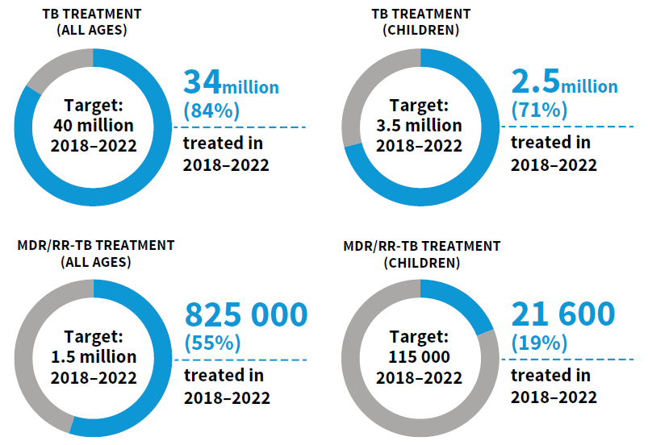

```{r setup, include=FALSE}
# Set chunk options.
# Results "asis" is useful to output markdown from a function
# Suppress messages, warnings and also the ## at the beginning of printed text

knitr::opts_chunk$set(echo = FALSE, 
                      results = "asis",
                      message = FALSE,
                      warning = FALSE,
                      error = TRUE)  # TEMP error=TRUE for debugging!

# Load output packages ----
# - - - - - - - - - - - - - - - - - - - - - - - - - - - - - - - - - -
library(ggplot2)
library(dplyr)
library(scales)
library(RColorBrewer)
library(whomap)
library(gtbreport)
library(here)

library(jsonlite)
library(Cairo)

# Load R functions ----
# - - - - - - - - - - - - - - - - - - - - - - - - - - - - - - - - - -
source(here("report/functions/html_links.R"))
source(here("report/functions/output_ggplot.R"))

# Get the data sets and computed values/statistics for section 2.1 ----
# - - - - - - - - - - - - - - - - - - - - - - - - - - - - - - - - - - - 
source(here('report/ch2-1_prepare_data.r'))

# Switch whether to show Irwin's doughnut chart
show_doughnuts = T

# Show static chart in addition to Kendo chart?
show_static = F

# Save underlying data files as CSV and charts as PDF files?
pdf_csv_folder = here::here("report/local/figures/ch2.1")
save_csv = TRUE
save_pdf = TRUE
save_cairo = TRUE

# Create the output folder (only if it doesn't yet exist)
dir.create(pdf_csv_folder, showWarnings = FALSE, recursive = TRUE)

```


```{css, echo=FALSE}
/* notifications table */
/* Recreating simple striped bootstrap table */
#notifs_table {
  border-spacing: 0;
  border-collapse: collapse;
  margin-top: 1em;
  margin-bottom: 1em;
  /* Next two lines to allow horizontal scrolling on narrow screens */
  display: block;
  overflow-x: auto;
}

#notifs_table th {
  border-bottom: 2px solid #DDDDDD;
  padding: 8px;
}

#notifs_table td {
  border-top: 1px solid #DDDDDD;
  padding: 8px;
}

/* light gray for odd rows */
#notifs_table tr:nth-child(odd) td {
  background-color: #F5F5F5;	
}

/* Bold for the final row with thick line above */
#notifs_table tr:last-child td {
  border-top: 2px solid #DDDDDD;
  font-weight:bold;	
}

/* light gray when hovering over a row */
#notifs_table tr:hover td {
  background-color: #DDDDDD;
}

/* Centre-align all column headings except for the first */
#notifs_table th:not(:first-child) {
  text-align: center !important;
}

/* prevent numbers from wrapping in any of the columns */
#notifs_table td {
  white-space: nowrap;
}

```

```{r css_js}
# Add standard stylesheets and javascript to support kendo
cat(writeLines(readLines(here("report/resources/headers.htm"))))
```

# 2.1 Case notifications  

<span class="red">**Draft! Prepared `r Sys.Date()` using country-reported data snapshot files from `r format(as.Date(snapshot_date), format="%d %B %Y")`!**</span>

Tuberculosis (TB) case notifications refer to people diagnosed with TB disease and officially reported as a case to national authorities. Case notification data have been systematically collected at national level and then reported to WHO on an annual basis since the mid-1990s, based on standard case definitions and associated guidance on the recording and reporting of data provided by WHO. The most recent WHO guidance was published in 2023 (`r ref_lnk("1")`). 

Globally in `r report_year - 1`, `r ftb(t2.1.1_global$c_newinc/1e6)` million people with a new episode of TB (referred to as new and relapse cases) were diagnosed and notified (`r lnk("Table 2.1.1")`). Of these, `r ftb(t2.1.1_txt$c_pulm_p)`% had pulmonary TB and `r ftb(100-t2.1.1_txt$c_pulm_p)`% had extrapulmonary TB. Collectively, the African, South-East Asia and Western Pacific regions accounted for almost `r ceiling(t2.1.1_txt$c_newinc_cum_p/10)*10`% of total notifications, with close to half in the South-East Asia Region alone. 

### `r anch("Table 2.1.1")`<span class="red">Table 2.1.1</span> Case notifications of people diagnosed with TB, MDR/RR-TB and XDR-TB, globally and for WHO regions, `r report_year - 1`

```{r table_2.1}

# Use t2.1.1_data  dataframe created by io/ch_notifications.r

# format the numerical data 
t2.1.1_data <- t2.1.1_data %>%
  mutate(across(where(is.numeric), int_spacer))

# Add % symbol to pct fields
t2.1.1_data <- t2.1.1_data %>%
  mutate(newrel_pulm_conf_pct = paste0(newrel_pulm_conf_pct, "%"),
         newrel_ep_pct = paste0(newrel_ep_pct, "%"))

# Create a table object using kable
table_header <- c('WHO region',
                  'Total notified',
                  'New and relapse^a^',
                  'Pulmonary new and relapse number',
                  'Pulmonary new and relapse bacteriologically confirmed (%)',
                  'Extrapulmonary new and relapse (%)',
                  'People living with HIV, new and relapse',
                  'MDR/RR-TB only^b^',
                  'pre-XDR-TB or XDR-TB^c^')

knitr::kable(t2.1.1_data,
             format = "html",
             col.names = table_header,
             align = 'lrrrccrrr',
             # Add a table ID so that it can be styled using extra CSS in Sitefinity
             table.attr = "id='notifs_table'")


```
<div class="footnote">^a^ *New and relapse* includes cases for which the treatment history is unknown. It excludes people who were re-registered as *treatment after failure*, as *treatment after lost to follow up* or as *other previously treated* (whose outcome after the most recent course of treatment was unknown or undocumented).  
^b^ RR-TB, rifampicin-resistant TB; MDR-TB, multidrug-resistant TB (defined as TB that is resistant to rifampicin and isoniazid). This column excludes any cases with known resistance to any fluoroquinolone.  
^c^ XDR, extensively drug-resistant TB. Pre-XDR-TB is defined as TB that is resistant to rifampicin and to any fluoroquinolone. XDR-TB is TB that is resistant to rifampicin and to any fluoroquinolone, and to at least one of bedaquiline or linezolid.</div>


<br />

In 2020 and 2021, disruptions associated with the coronavirus (COVID-19) pandemic had a substantial impact on TB case notifications (`r lnk("Fig. 2.1.1")`). Globally, the number of people newly diagnosed with TB and notified fell from `r ftb(f2.1.1_txt2$c_newinc_2019)` million in 2019 to `r ftb(f2.1.1_txt2$c_newinc_2020)` million in 2020 (`r round(f2.1.1_txt$pct_dif, 0)`%), in marked contrast to large increases between 2013 and 2019. There was then a partial recovery to `r ftb(f2.1.1_txt2$c_newinc_2021)` million in 2021. The `r ftb(f2.1.1_txt2$c_newinc_2022)` million people newly diagnosed and notified with TB in `r report_year - 1` is both a rebound to above the pre-COVID level and the highest number for a single year since WHO started to compile data. The big increase from 2020&#8211;2021 levels shows that there has been a good post-COVID recovery in access to and provision of health services in many (but not all) countries; it also likely reflects diagnosis of a backlog of people who developed TB in previous years but whose diagnosis was delayed due to COVID-related disruptions and an increase in the number of people falling ill with TB (<span style="color:#F21905">Section 1.1)</span>. 


### `r anch("Fig. 2.1.1")`<span style="color:#F21905">Fig. 2.1.1</span> Global trend in case notifications of people newly diagnosed with TB, 2010&#8211;`r report_year-1`

```{r echo=FALSE, message=FALSE, warning=FALSE, results = "asis", dev = 'png', fig_2.1.1, fig.alt="Global trend in notifications of new and relapse TB cases"} 

 f2.1.1_plot <- f2.1.1_data %>% 
  
  ggplot(aes(x=year, y=c_newinc)) +
  
  geom_line(size=1, color="darkblue") +
  
  scale_x_continuous(name="Year",
                     breaks = seq(0, report_year-1, by = 1)) + expand_limits(y = c(5.5e6,7.5e6)) +

  # display y-axis scale in millions
  scale_y_continuous(name = "Notifications per year (millions)", 
                     # Use the remainder operator in the labeller function to make sure we don't get weird effects
                     # when plotting small numbers
                     labels = function(i){ifelse((i/1e6) %% 1 == 0, round(i/1e6), round(i/1e6, 1))}) +

  theme_gtb()  +
  
  # Get rid of annoying x-axis line and ticks
  theme(axis.line.x = ggplot2::element_blank(),
        axis.ticks.x = element_blank())
  
output_ggplot(f2.1.1_plot, f2.1.1_data, show_static, pdf_csv_folder, save_csv, save_cairo, save_pdf=F)


```
<div id="fig_2_1_1"></div>

<br />

Trends in case notifications in the six WHO regions before, during and in the aftermath of the COVID-19 pandemic vary (`r lnk("Fig. 2.1.2")`). 
The pattern in the South-East Asia Region was very similar to the global trend, with a big reduction (-24%) between 2019 and 2020 followed by a partial recovery in 2021 and then a rebound to above the pre-COVID level in 2022; indeed, it is this region that drove the trend at global level. 
There was a comparable pattern in Region of the Americas. 
Notifications in the Eastern Mediterranean Region had already recovered to 2019 levels in 2021, with a further increase in `r report_year - 1` (mostly influenced by trends in the country with the highest burden of TB in the region, Pakistan). 
In the European Region, notifications fell at a rate above the historic trend in 2020, increased in 2021 (likely representing some backlog from 2020) and then fell. 
In the Western Pacific Region, there was a big drop in case notifications in 2020, a further fall in 2021 and a small increase in 2022. However, trends in the Western Pacific Region were driven by China, which accounted for just over half (51%) of total notifications in the region in the four years 2019-2022, and where notifications have been declining consistently for several years (`r lnk("Fig. 2.1.3")`). In most countries in this region, including three of the other high TB burden countries (Cambodia, the Philippines, Viet Nam), case notifications fell in either 2020 or 2021 but then recovered to 2019 levels (or beyond) in 2022 (`r lnk("Fig. 2.1.3")`). It was striking that notifications in the African Region increased throughout the pandemic, suggesting that any COVID-related disruptions had no or limited impact on TB case detection.


### `r anch("Fig. 2.1.2")`<span style="color:#F21905">Fig. 2.1.2</span> Regional trends in case notifications of people newly diagnosed with TB, 2010&#8211;`r report_year-1`

```{r echo=FALSE, message=FALSE, warning=FALSE, results = "asis", dev = 'png', fig_1.2, fig.alt="Trends in notifications of new and relapse TB cases by WHO region",fig.height=6} 

 f2.1.2_plot <- f2.1.2_data %>% 
  
  ggplot(aes(x=year, y=c_newinc)) +
    
  geom_line(size=1, color="darkblue") +
  
  facet_wrap( ~ entity, ncol = 3, scales="free_y") + #expand_limits(y = 0) +
  
  scale_x_continuous(name="Year",
                     breaks = seq(0, report_year-1, by = 2)) +

  # display y-axis scale in millions
  scale_y_continuous(name = "Notifications per year (millions)", 
                     # Use the remainder operator in the labeller function to make sure we don't get weird effects
                     # when plotting small numbers
                     # labels = function(i){ifelse((i/1e6) %% 1 == 0, sprintf("%0.1f", i/1e6), sprintf("%0.2f", i/1e6))}) +
                     # labels = function(i){ifelse((i/1e6) > 1, sprintf("%0.1f", i/1e6), sprintf("%0.2f", i/1e6))}) +
                     labels = function(i){sprintf("%0.2f", i/1e6)}) +
  
  geom_blank(aes(y = y_min)) +
  geom_blank(aes(y = y_max)) +

  theme_gtb()  +
  
  # Get rid of annoying x-axis line and ticks
  theme(axis.line.x = ggplot2::element_blank(),
        axis.ticks.x = element_blank())
  

output_ggplot(f2.1.2_plot, f2.1.2_data, show_static, pdf_csv_folder, save_csv, save_pdf)

```
<div class="row">
<div class="col-md-4">
  <div id="fig_2_1_2_afro"></div>
  <div id="fig_2_1_2_euro"></div>
</div>

<div class="col-md-4">
  <div id="fig_2_1_2_amro"></div>
  <div id="fig_2_1_2_emro"></div>
</div>

<div class="col-md-4">
  <div id="fig_2_1_2_searo"></div>
  <div id="fig_2_1_2_wpro"></div>
</div>
</div>

<br />
At country level, the 30 high TB burden and three global TB watchlist countries can be categorized into six groups, according to the timing and degree of disruptions to TB notifications during the COVID-19 pandemic and subsequent patterns of recovery in its aftermath (`r lnk("Fig. 2.1.3")`). The biggest group consists of `r f2.1.3a_txt` countries in which there were major reductions in TB case notifications in 2020 or 2021, followed by a rebound to 2019 levels or beyond in 2022 (`r lnk("Fig. 2.1.3a")`). In a further six countries, there were reductions between 2019 and 2021, followed by a partial recovery in 2022 (`r lnk("Fig. 2.1.3b")`). Nine countries reported either increased notifications throughout the pandemic and its aftermath or declines that were consistent with historic trends, suggesting no or only limited COVID-related disruptions to TB case detection (`r lnk("Fig. 2.1.3c")`, `r lnk("Fig. 2.1.3d")`). The countries in these two groups were mostly in the African Region, consistent with the regional data shown in `r lnk("Fig. 2.1.2")`. Five countries had unusual patterns that are difficult to explain: either a reduction in 2020, an apparent recovery in 2021 and then a reduction in 2022 (`r lnk("Fig. 2.1.3e")`); or a decline consistent with historic trends during the main years of the pandemic (2020 and 2021) followed by an increase in 2022 that was in stark contrast to pre-2022 trends (`r lnk("Fig. 2.1.3f")`).  


### `r anch("Fig. 2.1.3")`<span style="color:#F21905">Fig. 2.1.3</span> Case notifications of people newly diagnosed with TB in the 30 high TB burden and three global TB watchlist countries, categorized according to the timing and degree of disruptions during the COVID-19 pandemic and its aftermath, 2020&#8211;2022
#### (a) Negative impact in 2020^a^ or 2021, recovery to 2019 levels or beyond in 2022
```{r fig_2.1.3a, fig.alt="Trends in notification - a",fig.height=15}
f2.1.3a_plot <- f2.1.3_data %>%
  filter(col=="a") %>%
  mutate(country = factor(country, levels = f2.1.3a_data$country, ordered = TRUE)) %>%
  ggplot(aes(x = year, y = c_newinc, group=country)) +
  geom_line( size = 1.2, color="limegreen"
  ) +
  facet_wrap(~ country,strip.position="top",ncol=3, scales="free",drop = FALSE,labeller = label_wrap_gen(width = 20))+
  scale_x_continuous(name="Year",
                     breaks = seq(0, report_year-1, by = 1)) +
  ylab("Notifications per year") + 
  scale_y_continuous(labels = function(x) format(x, big.mark = " ",
                                                             scientific = FALSE),
                                 limits = function(x){c(0, max(0.1, x))}) +
  theme_gtb() +
  theme(strip.text.y.left = element_text(hjust=1,vjust = 1,angle=0,face="bold"),
        strip.placement = "outside",strip.background = element_blank()
  )

output_ggplot(f2.1.3a_plot, f2.1.3_data, show_static, pdf_csv_folder, save_csv, save_pdf, save_cairo)

```
<div class="row">
<div class="col-md-4">
  <div id="fig_2_1_3_PHL"></div>
  <div id="fig_2_1_3_PAK"></div>
  <div id="fig_2_1_3_BRA"></div>
  <div id="fig_2_1_3_UGA"></div>
  <div id="fig_2_1_3_VNM"></div>
</div>

<div class="col-md-4">
  <div id="fig_2_1_3_IDN"></div>
  <div id="fig_2_1_3_KEN"></div>
  <div id="fig_2_1_3_GAB"></div>
  <div id="fig_2_1_3_COG"></div>
</div>	

<div class="col-md-4">
  <div id="fig_2_1_3_IND"></div>
  <div id="fig_2_1_3_SLE"></div>
  <div id="fig_2_1_3_PNG"></div>
  <div id="fig_2_1_3_KHM"></div>
</div>
</div>
<div class="footnote">^a^ Countries are shown in descending order of the relative decline (%) between 2019 and 2020, which ranged from `r ftb(max(abs(f2.1.3a_data$pct_change))*100)`% to `r ftb(min(abs(f2.1.3a_data$pct_change))*100)`%.</div>
  
#### (b) Negative impact in 2020^a^&#8211;2021, partial recovery in 2022
```{r fig_2.1.3b, fig.alt="Trends in notification - b",fig.height=6}
f2.1.3b_plot <- f2.1.3_data %>%
  filter(col=="b") %>%
  mutate(country = factor(country, levels = f2.1.3b_data$country, ordered = TRUE)) %>%
  ggplot(aes(x = year, y = c_newinc, group=country)) +
  geom_line( size = 1.2, color="limegreen"
  ) +
 facet_wrap(~ country,strip.position="top",ncol=3, scales="free",drop = FALSE,labeller = label_wrap_gen(width = 20))+
  scale_x_continuous(name="Year",
                     breaks = seq(0, report_year-1, by = 1)) +

  ylab("Notifications per year") + 
  scale_y_continuous(labels = function(x) format(x, big.mark = " ",
                                                             scientific = FALSE),
                                 limits = function(x){c(0, max(0.1, x))}) +
  theme_gtb() +
  theme(strip.text.y.left = element_text(hjust=1,vjust = 1,angle=0,face="bold"),
        strip.placement = "outside",strip.background = element_blank()
  )

output_ggplot(f2.1.3b_plot, f2.1.3_data, show_static, pdf_csv_folder, save_csv, save_pdf)
```
<div class="row">
<div class="col-md-4">
  <div id="fig_2_1_3_LSO"></div>
  <div id="fig_2_1_3_AGO"></div>
</div>

<div class="col-md-4">
  <div id="fig_2_1_3_ZWE"></div>
  <div id="fig_2_1_3_MNG"></div>
</div>	

<div class="col-md-4">
  <div id="fig_2_1_3_MMR"></div>
  <div id="fig_2_1_3_THA"></div>
</div>	
</div>
<div class="footnote">^a^ Countries are shown in descending order of the relative decline (%) between 2019 and 2020, which ranged from `r ftb(max(abs(f2.1.3b_data$pct_change))*100)`% to `r ftb(min(abs(f2.1.3b_data$pct_change))*100)`%.</div>


#### (c) Year-on-year increases in notifications in 2020&#8211;2022
```{r fig_2.1.3c, fig.alt="Trends in notification - c",fig.height=6}
f2.1.3c_plot <- f2.1.3_data %>%
  filter(col=="c") %>%
  ggplot(aes(x = year, y = c_newinc, group=country)) +
  geom_line( size = 1.2, color="limegreen"
  ) +
  facet_wrap(~ country,strip.position="top",ncol=3, scales="free",drop = FALSE,labeller = label_wrap_gen(width = 20))+
  scale_x_continuous(name="Year",
                     breaks = seq(0, report_year-1, by = 1)) +
   ylab("Notifications per year") + 
  scale_y_continuous(labels = function(x) format(x, big.mark = " ",
                                                             scientific = FALSE),
                                 limits = function(x){c(0, max(0.1, x))}) +
  theme_gtb() +
  theme(strip.text.y.left = element_text(hjust=1,vjust = 1,angle=0,face="bold"),
        strip.placement = "outside",strip.background = element_blank()
  )

output_ggplot(f2.1.3c_plot, f2.1.3_data, show_static, pdf_csv_folder, save_csv, save_pdf)

```
<div class="row">
<div class="col-md-4">
  <div id="fig_2_1_3_CAF"></div>
  <div id="fig_2_1_3_NGA"></div>
</div>

<div class="col-md-4">
  <div id="fig_2_1_3_COD"></div>
  <div id="fig_2_1_3_TZA"></div>
</div>	

<div class="col-md-4">
  <div id="fig_2_1_3_MOZ"></div>
  <div id="fig_2_1_3_ZMB"></div>
</div>	
</div>

#### (d) No or limited departure from pre-2020 downward trend
```{r fig_2.1.3d, fig.alt="Trends in notification - d",fig.height=3.5}
f2.1.3d_plot <- f2.1.3_data %>%
  filter(col=="d") %>%
  ggplot(aes(x = year, y = c_newinc, group=country)) +
  geom_line( size = 1.2, color="limegreen"
  ) +
  facet_wrap(~ country,strip.position="top",ncol=3, scales="free",drop = FALSE,labeller = label_wrap_gen(width = 20))+
  scale_x_continuous(name="Year",
                     breaks = seq(0, report_year-1, by = 1)) +
    ylab("Notifications per year") + 
  scale_y_continuous(labels = function(x) format(x, big.mark = " ",
                                                             scientific = FALSE),
                                 limits = function(x){c(0, max(0.1, x))}) +
  theme_gtb() +
  theme(strip.text.y.left = element_text(hjust=1,vjust = 1,angle=0,face="bold"),
        strip.placement = "outside",strip.background = element_blank()
  )

output_ggplot(f2.1.3d_plot, f2.1.3_data, show_static, pdf_csv_folder, save_csv, save_pdf)

```
<div class="row">
<div class="col-md-4">
  <div id="fig_2_1_3_CHN"></div>
</div>

<div class="col-md-4">
  <div id="fig_2_1_3_PRK"></div>
</div>	

<div class="col-md-4">
  <div id="fig_2_1_3_RUS"></div>
</div>	
</div>


#### (e) Negative impact in 2020,^a^ recovery in 2021, decrease in 2022
```{r fig_2.1.3e, fig.alt="Trends in notification - e",fig.height=3.5}
f2.1.3e_plot <- f2.1.3_data %>%
  filter(col=="e") %>%
  mutate(country = factor(country, levels = f2.1.3e_data$country, ordered = TRUE)) %>%
  ggplot(aes(x = year, y = c_newinc, group=country)) +
  geom_line( size = 1.2, color="limegreen"
  ) +
  facet_wrap(~ country,strip.position="top",ncol=3, scales="free",drop = FALSE,labeller = label_wrap_gen(width = 20))+
  scale_x_continuous(name="Year",
                     breaks = seq(0, report_year-1, by = 1)) +
    ylab("Notifications per year") + 
  scale_y_continuous(labels = function(x) format(x, big.mark = " ",
                                                             scientific = FALSE),
                                 limits = function(x){c(0, max(0.1, x))}) +
  theme_gtb() +
  theme(strip.text.y.left = element_text(hjust=1,vjust = 1,angle=0,face="bold"),
        strip.placement = "outside",strip.background = element_blank()
  )

output_ggplot(f2.1.3e_plot, f2.1.3_data, show_static, pdf_csv_folder, save_csv, save_pdf)
```
<div class="row">
<div class="col-md-4">
  <div id="fig_2_1_3_BGD"></div>
</div>

<div class="col-md-4">
  <div id="fig_2_1_3_LBR"></div>
</div>	

<div class="col-md-4">
</div>	
</div>
<div class="footnote">^a^ Countries are shown in descending order of the relative decline (%) between 2019 and 2020, which ranged from `r ftb(max(abs(f2.1.3e_data$pct_change))*100)`% to `r ftb(min(abs(f2.1.3e_data$pct_change))*100)`%.</div>

#### (f) No or limited departure from pre-2020 downward trend in 2020 and 2021, but a marked reversal of this trend in 2022
```{r fig_2.1.3f, fig.alt="Trends in notification - f",fig.height=3.5}
f2.1.3f_plot <- f2.1.3_data %>%
  filter(col=="f") %>%
  ggplot(aes(x = year, y = c_newinc, group=country)) +
  # Add shaded box to highlight the covid years
  # annotate("rect", xmin = 2019.5, xmax = 2022.5, ymin = 0, ymax = Inf, 
  #          colour = "#EEEEEE", alpha = 0.1) +
  geom_line( size = 1.2, color="limegreen"
  ) +
  # geom_point(size = 3, color = "limegreen") +
  # geom_point(size = 1.5, color = "white") +
  facet_wrap(~ country,strip.position="top",ncol=3, scales="free",drop = FALSE,labeller = label_wrap_gen(width = 20))+
  scale_x_continuous(name="Year",
                     breaks = seq(0, report_year-1, by = 1)) +
    ylab("Notifications per year") + 
  scale_y_continuous(labels = function(x) format(x, big.mark = " ",
                                                             scientific = FALSE),
                                 limits = function(x){c(0, max(0.1, x))}) +
  theme_gtb() +
  theme(strip.text.y.left = element_text(hjust=1,vjust = 1,angle=0,face="bold"),
        strip.placement = "outside",strip.background = element_blank()
  )

output_ggplot(f2.1.3f_plot, f2.1.3_data, show_static, pdf_csv_folder, save_csv, save_pdf)

```
<div class="row">
<div class="col-md-4">
  <div id="fig_2_1_3_ETH"></div>
</div>

<div class="col-md-4">
  <div id="fig_2_1_3_NAM"></div>
</div>	

<div class="col-md-4">
  <div id="fig_2_1_3_ZAF"></div>
</div>	
</div>

<br />
Patterns of impact and recovery in 2020, 2021 and 2022, in percentage terms and relative to the baseline of 2019, are shown for the 30 high TB burden and three global TB watchlist countries in `r lnk("Fig. 2.1.4")`. As highlighted in previous global TB reports (`r ref_lnk("2, 3")`), the countries with the largest relative reductions in either 2020 or 2021 were (ordered according to the size of the relative reduction) `r gsub("(Republic)|(Russian)|(Democratic)|(Philip)", "the \\1\\2\\3\\4", knitr::combine_words(f2.1.4_txt$country, oxford_comma=FALSE))` (all>20%). 

   
### `r anch("Fig. 2.1.4")`<span style="color:#F21905">Fig. 2.1.4</span> Case notifications of people newly diagnosed with TB in 2020&#8211;2022 compared with 2019, 30 high TB burden and three global TB watchlist countries^a^
#### The vertical dashed line marks the level of 2019.
```{r fig_2.1.4, fig.alt="TB notifications in 2020 and 2021 compared with 2019",fig.height=8}

f2.1.4_plot <- f2.1.4_data %>%
  mutate(country = factor(country, levels = rev(f2.1.4_sel_order$country), ordered = TRUE)) %>% 
  mutate(shortfall = factor(shortfall, labels = c("2020","2021","2022"))) %>% 
  ggplot(aes(x=country, y=value*100, group=shortfall)) + 
  geom_hline(yintercept = 100,linetype = "dashed",color = "grey20",size=0.9) +
  geom_point(aes(col=shortfall),size=3) +
  scale_color_manual(values=c("dodgerblue3","goldenrod3","limegreen")) +
  xlab("")+ ylab("Number in 2020, 2021 and 2022 as a percentage of 2019") + 
  scale_y_continuous(breaks = seq(0, 250, by = 20)) +
  theme_gtb() +
  coord_flip() +
  theme(legend.position = "top",
        legend.title = element_blank()) + guides(color = guide_legend(reverse = F))

output_ggplot(f2.1.4_plot, f2.1.4_data, show_static, pdf_csv_folder, save_csv, save_pdf)

```
<div id="fig_2_1_4"></div>
<div class="footnote"> ^a^ The three global TB watchlist countries are Cambodia, the Russian Federation and Zimbabwe (`r lnk("Annex 3")` of main report).</div> 


<br />
Globally, the cumulative total number of people diagnosed with TB and officially reported from 2018 to `r report_year-1` was `r ftb(f2.1.5_txt$c_newinc/1e6)` million, `r ftb(f2.1.5_txt$c_newinc*100/40e6)`% of the 5-year target of treating 40 million people between 2018 and 2022 that was set at the UN high-level meeting on TB in 2018 (`r lnk("Fig. 2.1.5")`). This included `r ftb(f2.1.5_txt$c_new_014/1e6)` million children, `r ftb(f2.1.5_txt$c_new_014*100/3.5e6)`% of the five-year target of 3.5 million. A cumulative total of `r int_spacer(f2.1.5_txt$rr_treated)` people were treated for multidrug or rifampicin-resistant TB (MDR/RR-TB), `r ftb(f2.1.5_txt$rr_treated*100/1.5e6)`% of the five-year target of 1.5 million. This included `r int_spacer(f2.1.5_txt$rr_treated_014)` children, only `r ftb(f2.1.5_txt$rr_treated_014*100/115e3)`% of the five-year target. 


### `r anch("Fig. 2.1.5")`<span class="red">Fig. 2.1.5</span> Global numbers of people treated for TB between 2018 and `r report_year-1`, compared with cumulative targets set for 2018&#8211;2022 at the 2018 UN high-level meeting on TB

```{r eval=show_doughnuts, out.width = '60%'}



```

```{r fig_2.1.5, eval=!show_doughnuts, fig.alt="Doughnut chart showing how much of the UN high level meeting targets for 2018-2022 have been completed"}


# The code below produces a bar chart as an alternative to the doughnuts produced by Irwin
f2.1.5_plot <- f2.1.5_data %>%

  ggplot(aes(x=target_completion, y=value)) +
  geom_bar(stat="identity", fill="darkblue",width = 0.5) +

  expand_limits(y=c(0,100)) +
  scale_y_continuous(breaks = c(20, 40, 60 , 80, 100)) +
  ylab("Percent achieved") +
  scale_x_discrete(limits = c("rrmdr_014_tx_pct",
                              "rr_treated_pct",
                              "c_new_014_pct",
                              "c_newinc_pct"),
                   labels = c("115 thousand children treated\nfor drug-resistant TB",
                              "1.5 million treated\nfor drug-resistant TB",
                              "3.5 million children notified",
                              "40 million notified")) +
  xlab("2018-2022 cumulative target") +
  coord_flip() +

  theme_gtb() +
  geom_text(aes(label=round(value,0),x=target_completion,y=value*1.05),vjust=0.5,hjust=-0,col="black",size=3)

output_ggplot(f2.1.5_plot, f2.1.5_data, show_static = T, pdf_csv_folder, save_csv, save_pdf)


```


<br />
Most notified cases of TB are among adults (`r lnk("Fig. 2.1.6")`). Of the global total of people with a new or relapse episode of TB who were notified in `r report_year - 1`, `r ftb(f2.1.6_txt$pct_m)`% were men, `r ftb(f2.1.6_txt$pct_f)`% were women and `r ftb(f2.1.6_txt$pct_c)`% were children aged 0&#8211;14 years (the age groups related to children for which WHO routinely collects data are 0&#8211;4 and 5&#8211;14 years; it is recognized that the second category includes young adolescents). For the remainder, either age or sex were unknown. In general, notification data appear to understate the share of the total TB disease burden that is accounted for by men, since higher M:F ratios among adults have been found in national TB prevalence surveys (<span class="red">Section 1.4</span>). The drop in case notifications between 2019 and 2020 and subsequent recovery was similar for men and women, while both the drop in 2020 and subsequent recovery were more pronounced for children.

### `r anch("Fig. 2.1.6")`<span class="red">Fig. 2.1.6</span> Global trend in case notifications of people newly diagnosed with TB disaggregated by age and sex, 2013&#8211;`r report_year - 1`^a^
```{r fig_2.1.6, fig.alt="Bar chart showing numbers of adults and children notified with TB each year since 2015"}

# f2.1.6_plot <- f2.1.6_data %>% 
#   
#   ggplot(aes(x=year, y=how_many, fill=age_group)) +
# 
#   geom_bar(stat = "identity")  +
#   
#   scale_x_continuous(name="",
#                      breaks = 2010:(report_year-1)) +
#   
#   # display y-axis scale in millions
#   scale_y_continuous(name = "Millions", 
#                      labels = function(i){round(i/1e6)},
#                      limits = c(0, 8e6)) +
# 
#   scale_fill_manual("",
#                     breaks = c("c_new_15plus", "c_new_014" ),
#                     labels = c("Adults (aged \u226515 years)", "Children (aged 0\u201314 years)"),
#                     values = c("c_new_15plus"="#08acac", "c_new_014"="red")) +
# 
# 
#   theme_gtb() +
#   # Get rid of annoying x-axis line and ticks
#   theme(axis.line.x = ggplot2::element_blank(),
#         axis.ticks.x = element_blank())
# 

f2.1.6_plot <- f2.1.6b_data %>% 
  
  ggplot(aes(x=year, y=how_many)) +
  geom_line(aes(color=age_sex), size=1) +
  
  facet_wrap( ~ age_sex, ncol = 3, scales="free_y") + expand_limits(y = 0) +
  
  scale_x_continuous(name="Year",
                     breaks = seq(0, report_year-1, by = 2)) +
  scale_colour_manual(values = c("#6363C0", "#F4A81D", "red")) +
  
  # display y-axis scale in millions
  scale_y_continuous(name = "Notifications per year (millions)", 
                     # Use the remainder operator in the labeller function to make sure we don't get weird effects
                     # when plotting small numbers
                     # labels = function(i){ifelse((i/1e6) %% 1 == 0, sprintf("%0.1f", i/1e6), sprintf("%0.2f", i/1e6))}) +
                     # labels = function(i){ifelse((i/1e6) > 1, sprintf("%0.1f", i/1e6), sprintf("%0.2f", i/1e6))}) +
                     labels = function(i){sprintf("%0.2f", i/1e6)}) +
  
  theme_gtb()  +
  
  # Get rid of annoying x-axis line and ticks
  theme(axis.line.x = ggplot2::element_blank(),
        axis.ticks.x = element_blank(),
        legend.position = "none")

output_ggplot(f2.1.6_plot, f2.1.6b_data, show_static, pdf_csv_folder, save_csv, save_pdf, save_cairo)

```
<div class="row">
<div class="col-md-4">
  <div id="fig_2_1_6_men"></div>
</div>

<div class="col-md-4">
  <div id="fig_2_1_6_women"></div>
</div>	

<div class="col-md-4">
  <div id="fig_2_1_6_children"></div>
</div>	
</div>
<div class="footnote"> ^a^ Global data disaggregated for all three categories are available from 2013.</div> 


<br />
Although the global proportion of notified cases accounted for by children aged 0&#8211;14 years has been relatively stable (`r lnk("Fig. 2.1.6")`), there is considerable variation at country level (`r lnk("Fig. 2.1.7")`). There are recognized issues with the diagnosis and reporting of TB in children, including the use of variable case definitions and underreporting of cases diagnosed by paediatricians in the public and private sectors. Greater attention to the quality of TB notification data for children is warranted in many countries.

### `r anch("Fig. 2.1.7")`<span class="red">Fig. 2.1.7</span> Percentage of people notified as a new or relapse case of TB who were children aged 0&#8211;14 years,^a^ by country, `r report_year-1`

```{r fig_2.1.7, fig.alt="Map showing percentage of new and relapse TB cases that were children"}

f2.1.7_plot <- f2.1.7_data %>% 
  
  whomap(colours = brewer.pal(4, "BuGn"),
         legend.title = "Percentage (%)",
         na.col = "white",
         water.col = "white")


output_ggplot(f2.1.7_plot, f2.1.7_data, show_static = TRUE, pdf_csv_folder, save_csv, save_pdf)


```
<div class="footnote"> ^a^ In terms of TB notification data related to children specifically, the age groups for which WHO routinely collects data are 0&#8211;4 and 5&#8211;14 years. It is recognized that the second category includes young adolescents.</div> 


<br />
There is also considerable country variation in the proportion of notified cases diagnosed with extrapulmonary TB (`r lnk("Fig. 2.1.8")`). This may reflect underlying differences in TB epidemiology as well as diagnostic practices. 

### `r anch("Fig. 2.1.8")`<span class="red">Fig. 2.1.8</span> Percentage of people notified as a new or relapse case of TB who were diagnosed with extrapulmonary TB, by country, `r report_year-1`

```{r fig_2.1.8, fig.alt="Map showing percentage of extrapulmonary cases among new and relapse TB cases"}

f2.1.8_plot <- f2.1.8_data %>% 
  
  whomap(colours = brewer.pal(4, "YlOrRd"),
         legend.title = "Percentage (%)",
         na.col = "white",
         water.col = "white")


output_ggplot(f2.1.8_plot, f2.1.8_data, show_static = TRUE, pdf_csv_folder, save_csv, save_pdf)


```


<br />
There is striking country variation in the distribution of TB case notifications according to country of origin (`r lnk("Fig. 2.1.9")`). In several countries with a low incidence of TB, more than 75% of notified cases were among people of foreign origin.


### `r anch("Fig. 2.1.9")`<span class="red">Fig. 2.1.9</span> Percentage of people notified as a TB case (new, relapse or retreatment) who were of foreign origin, by country, `r report_year-1`

```{r fig_2.1.9, fig.alt="Map showing percentage of foreign born cases"}

f2.1.9_plot <- f2.1.9_data %>% 
  
  whomap(colours = brewer.pal(5, "BuPu"),
         legend.title = "Percentage (%)",
         na.col = "white",
         water.col = "white")


output_ggplot(f2.1.9_plot, f2.1.9_data, show_static = TRUE, pdf_csv_folder, save_csv, save_pdf)


```


<br />
Engagement of all care providers in the public and private sectors through public&#8211;private mix (PPM) initiatives can help to minimize the underreporting of people diagnosed with TB. Since 2015, the contribution of such initiatives to total notifications has grown in most of the seven countries defined as top global priorities for PPM (`r lnk("Fig. 2.1.10")`). Detailed data for `r nrow(filter(f2.1.10_data, year==report_year-1, !is.na(pcnt), pp=="private_pcnt"))-nrow(filter(f2.1.10a_data, year==report_year-1, pp=="private_pcnt"))` other countries are available in the online WHO global TB database.


### `r anch("Fig. 2.1.10")`<span class="red">Fig. 2.1.10</span> Contribution of public-private^a^ mix and public-public^b^ mix to case notifications of people diagnosed with TB in priority countries, 2010&#8211;`r report_year - 1`

```{r fig_2.1.10a, fig.alt="Panel plot of line charts showing percentage contribution of the private sector to TB notifications by year since 2010: priority", fig.height=6}

f2.1.10a_plot <- f2.1.10a_data %>% 
  
  mutate(pp = factor(pp, labels = c("Public-private","Public-public"))) %>% 
  
  ggplot(aes(x=year, y=pcnt, ymin=0, colour=pp)) +

  geom_line(size = 1.5) +
  
  facet_wrap(~ country, ncol = 4) +
  
  scale_x_continuous(name="Year",
                     breaks = seq (2010, report_year-1, by = 2)) +
  
  scale_y_continuous(name = "Contribution of public-private and public-public mix\nto total notifications (%)") +

  scale_color_manual(values=c("dodgerblue3","goldenrod3")) +
  
  theme_gtb() +
  
  # Get rid of annoying x-axis line and ticks
  theme(axis.line.x = ggplot2::element_blank(),
        axis.ticks.x = element_blank())

output_ggplot(f2.1.10a_plot, f2.1.10a_data, show_static, pdf_csv_folder, save_csv, save_pdf)


```
<div class="row">
<div class="col-md-4">
<div id="fig_2_1_10_BGD"></div>
<div id="fig_2_1_10_KEN"></div>
<div id="fig_2_1_10_PHL"></div>
</div>

<div class="col-md-4">
<div id="fig_2_1_10_IND"></div>
<div id="fig_2_1_10_NGA"></div>
</div>

<div class="col-md-4">
<div id="fig_2_1_10_IDN"></div>
<div id="fig_2_1_10_PAK"></div>
</div>
</div>
<div class="footnote">^a^ Public-private mix refers to engagement by the NTP with private sector providers of TB care. Examples include private individual and institutional providers, the corporate or business sector, mission hospitals, nongovernmental organizations, and faith-based organizations.<br /> 
^b^ Public-public mix refers to engagement by the NTP with public health sector providers of TB care that are not under the direct purview of the NTP. Examples include public hospitals, public medical colleges, prisons and detention centres, military facilities, and public health insurance organizations.</div>


<br />
Community engagement can help with referrals of people with TB symptoms to health facilities as well as treatment support; in `r filter(f2.1.11_data, dc_engage_community_display==1) %>% nrow()` countries from which WHO requested data in `r report_year-1`, such engagement was reported in a high proportion of basic management units (`r lnk("Fig. 2.1.11")`). 

### `r anch("Fig. 2.1.11")`<span class="red">Fig. 2.1.11</span> Percentage of basic management units in which there was community contribution to new TB case finding and/or to treatment adherence support, by country,^a^ `r report_year-1`

```{r fig_2.1.11, fig.alt="Map showing percentage of management units with community contributions to case finding and/or treatment support",  eval=datacoll}

f2.1.11_plot <- f2.1.11_data %>% 
  
  whomap(colours = brewer.pal(4, "OrRd"),
         legend.title = "Percentage (%)",
         na.col = "white",
         water.col = "white")


output_ggplot(f2.1.11_plot, f2.1.11_data, show_static = TRUE, pdf_csv_folder, save_csv, save_pdf)


```
<div class="footnote">^a^ Data were only requested from `r filter(f2.1.11_data, dc_engage_community_display==1) %>% nrow()` countries.</div>


<br />
Case-based digital surveillance systems enable timely reporting and use of TB data. In `r report_year-1`, `r ftb(f2.1.12_txt$cb_n)` countries and areas that collectively accounted for `r ftb(f2.1.12_txt$pct_notif_caseb)`% of officially notified TB cases were using a case-based digital surveillance system that covered all people diagnosed with TB (`r lnk("Fig. 2.1.12")`). This was similar to the level of `r report_year-1`, when `r ftb(cb_2021_data_txt$cb_n)` countries and areas that collectively accounted for `r ftb(cb_2021_data_txt$pct_notif_caseb)`% of officially notified TB cases were using such systems. Acceleration of progress in making the transition from paper-based reporting of aggregated TB data to case-based digital TB surveillance is particularly needed in the African Region. The latest WHO guidance on TB surveillance (`r ref_lnk("1")`) gives specific attention to the establishment or strengthening of case-based digital TB surveillance.

### `r anch("Fig. 2.1.12")`<span class="red">Fig. 2.1.12</span> Countries with national case-based digital surveillance systems for TB, `r report_year-1`

```{r fig_2.1.12, fig.alt="Map showing which countries have case-based TB surveillance systems",  eval=datacoll}

f2.1.12_plot <- f2.1.12_data %>% 
  
  whomap(colours = brewer.pal(4, "Blues"),
         legend.title = "Country response",
         na.col = "white",
         water.col = "white")


output_ggplot(f2.1.12_plot, f2.1.12_data, show_static = TRUE, pdf_csv_folder, save_csv, save_pdf)


```


Further country-specific details about TB case notifications are available in the [Global tuberculosis report app](https://www.who.int/teams/global-tuberculosis-programme/data#app) and [country profiles](https://worldhealthorg.shinyapps.io/tb_profiles/).

Data shown on this webpage are as of `r format(as.Date(snapshot_date), format="%d %B %Y")` (see <span class="red">Annex 2</span> of the main report for more details).

`r anch("refs")`

<hr style="border:1px solid gray20">

**References**

1. Guidance on tuberculosis surveillance. Geneva: World Health Organization; 2023 (in press).
  
2. Global tuberculosis report 2021. Geneva: World Health Organization; 2021 (https://iris.who.int/handle/10665/346387).
  
3. Global tuberculosis report 2022. Geneva: World Health Organization; 2022 (https://iris.who.int/handle/10665/363752).
  

```{r js_functions}
# Insert javascript file containing common Kendo number formatting functions ----
cat(writeLines(readLines(here("report/resources/gtbr_js.htm"))))
```


<script type="text/javascript">
/* JSON data objects for the figures */
var fig_2_1_1_data = `r f2.1.1_data %>% mutate(c_newinc = c_newinc/1e6) %>% select(year, c_newinc) %>% toJSON("rows")`; 

var fig_2_1_2_data = `r f2.1.2_data %>% mutate(c_newinc = c_newinc/1e6) %>% select(year, entity, c_newinc) %>% toJSON("rows")`;  

var fig_2_1_4_data = `r f2.1.4_data %>% mutate(value = value*100) %>% select(country, year=shortfall, value) %>% pivot_wider(names_from = year, values_from = value) %>% arrange(pct1920) %>% mutate(pct2019=100) %>% mutate(country=str_wrap(country, width = 27,indent = 2)) %>% toJSON("rows")`   ;

var fig_2_1_3_data = `r f2.1.3_data %>% select(country, year, c_newinc) %>% toJSON("rows")`   ;  

var fig_2_1_6_data = `r f2.1.6_data %>% pivot_wider(names_from = age_group, values_from = how_many) %>% select(year, c_new_014, c_new_15plus) %>% toJSON("rows")` ;  

var fig_2_1_6b_data = `r f2.1.6b_data %>% toJSON("rows")`;  


var fig_2_1_10_data = `r f2.1.10_data %>% pivot_wider(names_from = pp, values_from = pcnt)  %>% toJSON("rows")`  ;  


</script>

```{js, echo=FALSE}
/* Functions to create the figures */
function createFig_2_1_1() {
		$("#fig_2_1_1").kendoChart({
			dataSource: fig_2_1_1_data,
			chartArea: {
				height: 400
			},	
			legend: {
				position: "bottom"
			},
			seriesDefaults: {
				type: "line"
			},
			series: [{
				field: "c_newinc",
				color: "navy"
			}],
			valueAxis: {
				labels: {
					format: "{0}"
				},
				title: {
					text: "Notifications per year (millions)"
				},
				line: {
					visible: false
				},
				max: 7.5,
				min: 5,
			},
			categoryAxis: {
				field: "year",
				labels: {
					rotation: "auto"
				},
				majorGridLines: {
					visible: false
				},
				title: {
					text: "Year"
				}
			},
			tooltip: {
				visible: true,
				format: "{0:0.00}",
				template: "#= category #, #= value.toPrecision(3) # million",
			}
		});
}


function createFig_2_1_2(fig_ID, data, filter) {
  
  		// Filter the dataset on the country variable
		dataJSON = data.filter( element => element.entity == filter);
  
		$(fig_ID).kendoChart({
			dataSource: dataJSON,
			chartArea: {
				height: 250
			},	
      title: {
				text: filter,
				color: "black",
				font: "bold 14px  Arial,Helvetica,sans-serif",
        align: "center"
			},	
			legend: {
				position: "bottom"
			},
			seriesDefaults: {
				type: "line"
			},
			series: [{
				field: "c_newinc",
				color: "navy",
        tooltip: {
				visible: true,
				format: "{0:0.00}",
				template: "#= category #, #= value.toPrecision(3) # million",
			}
			}],
			valueAxis: {
				labels: {
					format: "{0}"
				},
				title: {
					text: "Notifications per year\n(millions)"
				},
				line: {
					visible: false
				},
			},
			categoryAxis: {
				field: "year",
				labels: {
					rotation: "auto"
				},
				majorGridLines: {
					visible: false
				},
				title: {
					text: "Year"
				}
			}

		});
}

function createFig_2_1_3(fig_ID, data, filter) {
  
  		// Filter the dataset on the country variable
		dataJSON = data.filter( element => element.country == filter);
  
		$(fig_ID).kendoChart({
			dataSource: dataJSON,
			chartArea: {
				height: 250
			},	
      title: {
				text: filter,
				color: "black",
				font: "bold 14px  Arial,Helvetica,sans-serif"
			},	
			legend: {
				position: "bottom"
			},
			seriesDefaults: {
				type: "line"
			},
			series: [{
				field: "c_newinc",
				color: "limegreen",
        tooltip: {
				visible: true,
				format: "{0}",
				// Use non-breaking spaces as group separators
				template: "#= category #: #= num_spacer(value) #"
			}
			}],
			valueAxis: {
				labels: {
					// Use breaking spaces as group separators
					template: "#= axis_spacer(value) #"
 				},
				title: {
					text: "Notifications per year"
				},
				line: {
					visible: false
				}
			},
			categoryAxis: {
				field: "year",
				labels: {
					rotation: "auto"
				},
				majorGridLines: {
					visible: false
				},
				title: {
					text: "Year"
				},
//       plotBands: [
//      { from: 5, to: 7, color: "lightgrey", opacity: 0.3}
//        ]
			}

		});
}


  function createFig_2_1_4() {
   
		$("#fig_2_1_4").kendoChart({
			dataSource: fig_2_1_4_data,
			chartArea: {
				height: 900
			},	
			legend: {
				position: "bottom"
			},
			series: [{
        type: "bar",
				field: 0,
				opacity: 0
			}, {
        type: "line",
				field: "pct1920",
        opacity: 0,
				color: "dodgerblue",
        markers: {
          visible: true,
          background: "dodgerblue",
          size: 8
        },
			tooltip: {
				visible: true,
        background: "dodgerblue",
				template: "#= category # (2020): #= tb_format_pct(value) #%"
			}
			},{
        type: "line",
				field: "pct1921",
        opacity: 0,
				color: "goldenrod",
        markers: {
          visible: true,
          background: "goldenrod",
          size: 8
        },
			tooltip: {
				visible: true,
        background: "goldenrod",
				template: "#= category # (2021): #= tb_format_pct(value) #%"
			}
			}, {
        type: "line",
				field: "pct1922",
        opacity: 0,
				color: "limegreen",
        markers: {
          visible: true,
          background: "limegreen",
          size: 8
        },
			tooltip: {
				visible: true,
        background: "limegreen",
				template: "#= category # (2022): #= tb_format_pct(value) #%"
			}
			},{
        type: "line",
				name: "2020",
				color: "dodgerblue"
			},{
        type: "line",
				name: "2021",
				color: "goldenrod"
			},{
        type: "line",
				name: "2022",
				color: "limegreen"
			},{
        type: "line",
        dashType: "dash",
        field: "pct2019",
        color: "black",
        markers: {
             size: 0,
             opacity: 0
           },
			tooltip: {
				visible: false,
			}
      },],
			valueAxis: {
				labels: {
					format: "{0}",
					rotation: "auto"
				},
				title: {
					text: "Number in 2020, 2021 and 2022\nas a percentage of 2019"
				},
				line: {
					visible: false
				},
				min: 40,
				max: 260,
				axisCrossingValue: 40,
				majorUnit: 20
				
			},
			categoryAxis: {
				field: "country",
				labels: {
					rotation: "auto"
				},
				majorGridLines: {
					visible: true
				}
			}

		});
}

function createFig_2_1_6() {
		$("#fig_2_1_6").kendoChart({
			dataSource: fig_2_1_6_data,
			chartArea: {
				height: 500
			},	
			legend: {
				position: "bottom"
			},
			seriesDefaults: {
				type: "column",
        stack: true,
        gap: 0.2
			},
			series: [{
        name: "Adults (aged &ge;15 years)",
				field: "c_new_15plus",
				color: "#08acac",
        tooltip: {
				visible: true,
				template: "Adults (aged \u226515 years) (#= category #): #= num_spacer(value) #"
			}
			},{
        name: "Children (aged 0&#8211;14 years)",
				field: "c_new_014",
				color: "red",
        tooltip: {
				visible: true,
				template: "Children (aged 0\u201314 years) (#= category #): #= num_spacer(value) #"
			}
			},
              ],
			valueAxis: {
				labels: {
				template: "#= kendo.format('{0}',value/1000000) #",
				},
				title: {
					text: "Millions"
				},
				line: {
					visible: false
				}
			},
			categoryAxis: {
				field: "year",
				labels: {
					rotation: "auto"
				},
				majorGridLines: {
					visible: false
				}			}
		});
}

function createFig_2_1_6b(fig_ID, data, filter, color) {
  
  		// Filter the dataset on the country variable
		dataJSON = data.filter( element => element.age_sex == filter);
  
		$(fig_ID).kendoChart({
			dataSource: dataJSON,
			chartArea: {
				height: 500
			},	
      title: {
				text: filter,
				color: "black",
				font: "bold 14px  Arial,Helvetica,sans-serif",
        align: "center"
			},	
			legend: {
				position: "bottom"
			},
			seriesDefaults: {
				type: "line"
			},
			series: [{
				field: "how_many",
				color: color,
        tooltip: {
				visible: true,
				template: "#= category #: #= num_spacer(value) #"
			}
			}],
			valueAxis: {
				labels: {
				template: "#= kendo.format('{0}',value/1000000) #",
				},
				title: {
					text: "Notifications per year\n(Millions)"
				},
				line: {
					visible: false
				},
			},
			categoryAxis: {
				field: "year",
				labels: {
					rotation: "auto",
          step: 2
				},
				majorGridLines: {
					visible: false
				},
				title: {
					text: "Year"
				}
			}

		});
}


function createFig_2_1_10(fig_ID, data, filter) {
  
  		// Filter the dataset on the country variable
		dataJSON = data.filter( element => element.country == filter);
  
		$(fig_ID).kendoChart({
			dataSource: dataJSON,
			chartArea: {
				height: 300
			},	
      title: {
				text: filter,
				color: "black",
				font: "bold 14px  Arial,Helvetica,sans-serif",
        align: "center"
			},	
			legend: {
				position: "bottom"
			},
			seriesDefaults: {
				type: "line"
			},
			series: [{
        name: "Public&#8211;private mix",
				field: "private_pcnt",
				color: "dodgerblue",
				markers: {
          size: 3
        },
        tooltip: {
				visible: true,
				template: "Public-private mix (#= category #): #= num_spacer(Number(value.toPrecision(2))) #%"
			}
			},{
        name: "Public&#8211;public mix",
				field: "public_pcnt",
				color: "goldenrod",
				markers: {
          size: 3
        },
        tooltip: {
				visible: true,
				template: "Public-public mix (#= category #): #= num_spacer(Number(value.toPrecision(2))) #%"
			}
			},
              ],

			valueAxis: {
				labels: {
					format: "{0}"
				},
				title: {
					text: "Contribution to\ntotal notifications (%)",
          font: "14px Arial,Helvetica,sans-serif"
				},
				line: {
					visible: false
				},
				max: 100,
        min: 0
			},
			categoryAxis: {
				field: "year",
        labels: {
					rotation: 0,
          step: 2
          },
				majorGridLines: {
					visible: false
				},
				title: {
					text: "Year"
				}
			}

		});
}
```

```{js, echo=FALSE}
/* Create the figures after the document has been loaded */

$(document).ready(function () {
                  createFig_2_1_1();
                  createFig_2_1_2("#fig_2_1_2_afro",fig_2_1_2_data,"African Region");
                  createFig_2_1_2("#fig_2_1_2_amro",fig_2_1_2_data,"Region of the Americas");
                  createFig_2_1_2("#fig_2_1_2_searo",fig_2_1_2_data,"South-East Asia Region");
                  createFig_2_1_2("#fig_2_1_2_euro",fig_2_1_2_data,"European Region");
                  createFig_2_1_2("#fig_2_1_2_emro",fig_2_1_2_data,"Eastern Mediterranean Region");
                  createFig_2_1_2("#fig_2_1_2_wpro",fig_2_1_2_data,"Western Pacific Region");
                  createFig_2_1_4();
                  createFig_2_1_3("#fig_2_1_3_PHL",fig_2_1_3_data,"Philippines");
                  createFig_2_1_3("#fig_2_1_3_IND",fig_2_1_3_data,"India");
                  createFig_2_1_3("#fig_2_1_3_BRA",fig_2_1_3_data,"Brazil");
                  createFig_2_1_3("#fig_2_1_3_IDN",fig_2_1_3_data,"Indonesia");
                  createFig_2_1_3("#fig_2_1_3_LBR",fig_2_1_3_data,"Liberia");
                  createFig_2_1_3("#fig_2_1_3_GAB",fig_2_1_3_data,"Gabon");
                  createFig_2_1_3("#fig_2_1_3_ZWE",fig_2_1_3_data,"Zimbabwe");
                  createFig_2_1_3("#fig_2_1_3_KEN",fig_2_1_3_data,"Kenya");
                  createFig_2_1_3("#fig_2_1_3_PNG",fig_2_1_3_data,"Papua New Guinea");
                  createFig_2_1_3("#fig_2_1_3_BGD",fig_2_1_3_data,"Bangladesh");
                  createFig_2_1_3("#fig_2_1_3_UGA",fig_2_1_3_data,"Uganda");
                  createFig_2_1_3("#fig_2_1_3_PAK",fig_2_1_3_data,"Pakistan");
                  createFig_2_1_3("#fig_2_1_3_COG",fig_2_1_3_data,"Congo");
                  createFig_2_1_3("#fig_2_1_3_SLE",fig_2_1_3_data,"Sierra Leone");
                  createFig_2_1_3("#fig_2_1_3_LSO",fig_2_1_3_data,"Lesotho");
                  createFig_2_1_3("#fig_2_1_3_AGO",fig_2_1_3_data,"Angola");
                  createFig_2_1_3("#fig_2_1_3_MMR",fig_2_1_3_data,"Myanmar");
                  createFig_2_1_3("#fig_2_1_3_MNG",fig_2_1_3_data,"Mongolia");
                  createFig_2_1_3("#fig_2_1_3_RUS",fig_2_1_3_data,"Russian Federation");
                  createFig_2_1_3("#fig_2_1_3_KHM",fig_2_1_3_data,"Cambodia");
                  createFig_2_1_3("#fig_2_1_3_VNM",fig_2_1_3_data,"Viet Nam");
                  createFig_2_1_3("#fig_2_1_3_THA",fig_2_1_3_data,"Thailand");
                  createFig_2_1_3("#fig_2_1_3_CAF",fig_2_1_3_data,"Central African Republic");
                  createFig_2_1_3("#fig_2_1_3_NGA",fig_2_1_3_data,"Nigeria");
                  createFig_2_1_3("#fig_2_1_3_COD",fig_2_1_3_data,"Democratic Republic of the Congo");
                  createFig_2_1_3("#fig_2_1_3_TZA",fig_2_1_3_data,"United Republic of Tanzania");
                  createFig_2_1_3("#fig_2_1_3_MOZ",fig_2_1_3_data,"Mozambique");
                  createFig_2_1_3("#fig_2_1_3_ZMB",fig_2_1_3_data,"Zambia");
                  createFig_2_1_3("#fig_2_1_3_CHN",fig_2_1_3_data,"China");
                  createFig_2_1_3("#fig_2_1_3_NAM",fig_2_1_3_data,"Namibia");
                  createFig_2_1_3("#fig_2_1_3_PRK",fig_2_1_3_data,"Democratic People's Republic of Korea");
                  createFig_2_1_3("#fig_2_1_3_ZAF",fig_2_1_3_data,"South Africa");
                  createFig_2_1_3("#fig_2_1_3_ETH",fig_2_1_3_data,"Ethiopia");

                 <!-- createFig_2_1_6(); -->
                  createFig_2_1_6b("#fig_2_1_6_men",fig_2_1_6b_data,"Men (aged \u226515 years)","#6363C0");   
                  createFig_2_1_6b("#fig_2_1_6_women",fig_2_1_6b_data,"Women (aged \u226515 years)","#F4A81D");   
                  createFig_2_1_6b("#fig_2_1_6_children",fig_2_1_6b_data,"Children (aged 0\u201314 years)","red");   

                  createFig_2_1_10("#fig_2_1_10_BGD",fig_2_1_10_data,"Bangladesh");
                  createFig_2_1_10("#fig_2_1_10_NGA",fig_2_1_10_data,"Nigeria");
                  createFig_2_1_10("#fig_2_1_10_IND",fig_2_1_10_data,"India");
                  createFig_2_1_10("#fig_2_1_10_PAK",fig_2_1_10_data,"Pakistan");
                  createFig_2_1_10("#fig_2_1_10_IDN",fig_2_1_10_data,"Indonesia");
                  createFig_2_1_10("#fig_2_1_10_PHL",fig_2_1_10_data,"Philippines");
                  createFig_2_1_10("#fig_2_1_10_MMR",fig_2_1_10_data,"Myanmar");
                  
                  createFig_2_1_10("#fig_2_1_10_AFG",fig_2_1_10_data,"Afghanistan");
                  createFig_2_1_10("#fig_2_1_10_COD",fig_2_1_10_data,"Democratic Republic of the Congo");
                  createFig_2_1_10("#fig_2_1_10_GHA",fig_2_1_10_data,"Ghana");
                  createFig_2_1_10("#fig_2_1_10_IRQ",fig_2_1_10_data,"Iraq");
                  createFig_2_1_10("#fig_2_1_10_MWI",fig_2_1_10_data,"Malawi");
                  createFig_2_1_10("#fig_2_1_10_SOM",fig_2_1_10_data,"Somalia");
                  createFig_2_1_10("#fig_2_1_10_THA",fig_2_1_10_data,"Thailand");
                  
                  createFig_2_1_10("#fig_2_1_10_AGO",fig_2_1_10_data,"Angola");
                  createFig_2_1_10("#fig_2_1_10_EGP",fig_2_1_10_data,"Egypt");
                  createFig_2_1_10("#fig_2_1_10_JOR",fig_2_1_10_data,"Jordan");
                  createFig_2_1_10("#fig_2_1_10_MAR",fig_2_1_10_data,"Morocco");
                  createFig_2_1_10("#fig_2_1_10_ZAF",fig_2_1_10_data,"South Africa");
                  createFig_2_1_10("#fig_2_1_10_TZA",fig_2_1_10_data,"United Republic of Tanzania");

                  createFig_2_1_10("#fig_2_1_10_SWZ",fig_2_1_10_data,"Eswatini");
                  createFig_2_1_10("#fig_2_1_10_KEN",fig_2_1_10_data,"Kenya");
                  createFig_2_1_10("#fig_2_1_10_LKA",fig_2_1_10_data,"Sri Lanka");
                  createFig_2_1_10("#fig_2_1_10_VNM",fig_2_1_10_data,"Viet Nam");

                  createFig_2_1_10("#fig_2_1_10_KHM",fig_2_1_10_data,"Cambodia");
                  createFig_2_1_10("#fig_2_1_10_ETH",fig_2_1_10_data,"Ethiopia");
                  createFig_2_1_10("#fig_2_1_10_IRN",fig_2_1_10_data,"Iran (Islamic Republic of)");
                  createFig_2_1_10("#fig_2_1_10_LBN",fig_2_1_10_data,"Lebanon");
                  createFig_2_1_10("#fig_2_1_10_NPL",fig_2_1_10_data,"Nepal");
                  createFig_2_1_10("#fig_2_1_10_KOR",fig_2_1_10_data,"Republic of Korea");
                  createFig_2_1_10("#fig_2_1_10_SDN",fig_2_1_10_data,"Sudan");

}); 

```
