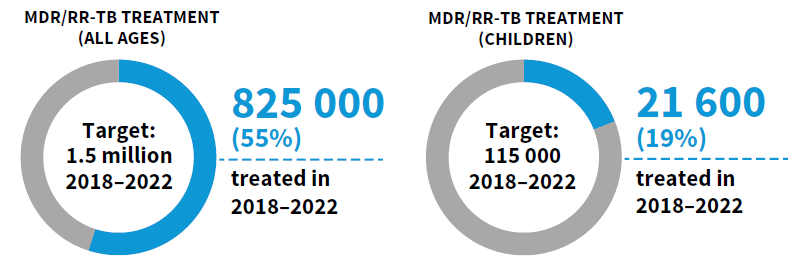

```{r setup, include=FALSE}
# Set chunk options.
# Results "asis" is useful to output markdown from a function
# Suppress messages, warnings and also the ## at the beginning of printed text

knitr::opts_chunk$set(echo = FALSE, 
                      results = "asis",
                      message = FALSE,
                      warning = FALSE,
                      error = TRUE)  # TEMP error=TRUE for debugging!

# Kill any attempt at using factors, unless we explicitly want them!
options(stringsAsFactors=FALSE)

# Load output packages ----
# - - - - - - - - - - - - - - - - - - - - - - - - - - - - - - - - - -
library(ggplot2)
library(dplyr)
library(scales)
library(RColorBrewer)
library(whomap)
library(gtbreport)
library(here)
library(readr)

# Load R functions ----
# - - - - - - - - - - - - - - - - - - - - - - - - - - - - - - - - - -
source(here("report/functions/html_links.R"))
source(here("report/functions/output_ggplot.R"))

# Get the data sets and computed values/statistics for section 2.1 ----
# - - - - - - - - - - - - - - - - - - - - - - - - - - - - - - - - - - - 
source(here('report/ch2-4_prepare_data.r'))

# Show static chart in addition to Kendo chart?
show_static = F

# Switch whether to show Irwin's doughnut charts
show_doughnuts = T

# Save underlying data files as CSV and charts as PDF files?
pdf_csv_folder = here::here("report/local/figures/ch2.4")
save_csv = TRUE
save_pdf = TRUE

# Create the output folder (only if it doesn't yet exist)
dir.create(pdf_csv_folder, showWarnings = FALSE, recursive = TRUE)

```


```{r css_js}
# Add standard stylesheets and javascript to support kendo
cat(writeLines(readLines(here("report/resources/headers.htm"))))
```

# 2.4 Drug-resistant TB: treatment enrolment, coverage and outcomes  

<span class="red">**Draft! Prepared `r Sys.Date()` using country-reported data snapshot files from `r format(as.Date(snapshot_date), format="%d %B %Y")`!**</span>

People with drug-resistant TB (DR-TB) need treatment with regimens that include second-line drugs, such as bedaquiline and fluoroquinolones (`r ref_lnk("1")`). WHO recommends different regimens for rifampicin-resistant TB (RR-TB) or multidrug-resistant TB (MDR-TB, defined as resistance to both rifampicin and isoniazid); isoniazid-resistant TB; pre-extensively drug-resistant TB (pre-XDR-TB, defined as TB that is resistant to rifampicin and any fluoroquinolone) and XDR-TB (resistance to rifampicin, any fluoroquinolone and at least one of bedaquiline or linezolid). These regimens are more expensive (&#8805;US$ 1000 per person) and cause more adverse events than first-line treatments for drug-susceptible TB. 

Globally in `r report_year-1`, `r int_spacer(f2.4.1_txt$rr_2022)` people were enrolled on treatment for MDR/RR-TB. This was a small increase from `r int_spacer(f2.4.1_txt$rr_2021)` in `r report_year-2` (+`r ftb(f2.4.1_txt$pct_increase_2221)`%) and `r int_spacer(f2.4.1_txt$rr_2020)` in `r report_year-3`  (+`r ftb(f2.4.1_txt$pct_increase_2220)`%), but still below `r int_spacer(f2.4.1_txt$rr_2019)` in `r report_year-4`. Most of those enrolled on treatment were people aged &#8805;15 years (`r lnk("Fig. 2.4.1")`). 

### `r anch("Fig. 2.4.1")`<span class="red">Fig. 2.4.1</span> The global number of people reported to have been enrolled on treatment for MDR/RR-TB, 2010&#8211;`r report_year-1`
<div class="subhead">Global data disaggregated by age are not available for the years before 2018.</div>

```{r fig_2.4.1, fig.alt="Bar chart of numbers treated for MDR-TB each year since 2010"}

f2.4.1_plot <- f2.4.1b_data %>% 
  
  ggplot(aes(x=year, y=how_many)) +
  geom_line(aes(color=age_group), size=2) +
  
  facet_wrap( ~ age_group, ncol = 3, scales="free") + expand_limits(y = 0) +
  
  scale_x_continuous(name="Year",
                     breaks = seq(0, report_year-1, by = 2)) +
  
  scale_colour_manual(values = c("#A5D727", palette_gtb("succ"), "red")) +
  
  # display y-axis scale in millions
  scale_y_continuous(name = "Thousands", labels = function(i){round(i/1e3)}) +
  
  theme_gtb()  +
  
  # Get rid of annoying x-axis line and ticks
  theme(axis.line.x = ggplot2::element_blank(),
        axis.ticks.x = element_blank(),
        legend.position = "none")


output_ggplot(f2.4.1_plot, f2.4.1_data, show_static, pdf_csv_folder, save_csv, save_pdf)

```
<div class="row">
<div class="col-md-4">
  <div id="fig_2_4_1_all"></div>
</div>

<div class="col-md-4">
  <div id="fig_2_4_1_adult"></div>
</div>	

<div class="col-md-4">
  <div id="fig_2_4_1_children"></div>
</div>	
</div>
<div id="fig_2_4_1"></div>

<hr />
<br />

Trends in treatment enrolment between 2010 and `r report_year-1` vary considerably among the 30 high MDR/RR-TB burden countries (`r lnk("Fig. 2.4.2")`).

### `r anch("Fig. 2.4.2")`<span class="red">Fig. 2.4.2</span> Number of people diagnosed with MDR/RR-TB<span style="color:#277abe;"> (blue)</span> and enrolled on treatment for MDR/RR-TB <span style="color:red;"> (red)</span>, 2010&#8211;`r report_year-1`, 30 high MDR/RR-TB burden countries

```{r fig_2.4.2, fig.alt="Panel of line charts of MDR/RR-TB cases detected, MDR/RR-TB put on treatment since 2010 for 30 countries", fig.height=12}

f2.4.2_plot <- f2.4.2_data %>%
  
  ggplot(aes(x=year, y=rr_detected, ymin=0)) +
  
  geom_line(size=1, colour = "#277abe") +
  
  geom_line(aes(year, rr_treated),
                      size=1,
                      colour="Red") +
  
  facet_wrap( ~ country, 
              ncol = 5, 
              scales="free_y",
              # Use the labeller function to make sure long country names are wrapped in panel headers
              labeller = label_wrap_gen(width = 20)) +

  scale_x_continuous(name = "Year", breaks = c(2010, 2015, report_year-1)) +
  
  scale_y_continuous(name = "Number per year",
                     labels = int_spacer) + 
  
  theme_gtb()  +
  
  # Get rid of annoying x-axis line and ticks
  theme(axis.line.x = ggplot2::element_blank(),
        axis.ticks.x = element_blank())


output_ggplot(f2.4.2_plot, f2.4.2_data, show_static, pdf_csv_folder, save_csv, save_pdf)

```
<div class="row">
<div class="col-md-4">
<div id="fig_2_4_2_AGO"></div>
</div>
<div class="col-md-4">
<div id="fig_2_4_2_AZE"></div>
</div>
<div class="col-md-4">
<div id="fig_2_4_2_BGD"></div>
</div>
</div>
<div class="row">
<div class="col-md-4">
<div id="fig_2_4_2_BLR"></div>
</div>
<div class="col-md-4">
<div id="fig_2_4_2_CHN"></div>
</div>
<div class="col-md-4">
<div id="fig_2_4_2_PRK"></div>
</div>
</div>
<div class="row">
<div class="col-md-4">
<div id="fig_2_4_2_COD"></div>
</div>
<div class="col-md-4">
<div id="fig_2_4_2_IND"></div>
</div>
<div class="col-md-4">
<div id="fig_2_4_2_IDN"></div>
</div>
</div>
<div class="row">
<div class="col-md-4">
<div id="fig_2_4_2_KAZ"></div>
</div>
<div class="col-md-4">
<div id="fig_2_4_2_KGZ"></div>
</div>
<div class="col-md-4">
<div id="fig_2_4_2_MNG"></div>
</div>
</div>
<div class="row">
<div class="col-md-4">
<div id="fig_2_4_2_MOZ"></div>
</div>
<div class="col-md-4">
<div id="fig_2_4_2_MMR"></div>
</div>
<div class="col-md-4">
<div id="fig_2_4_2_NPL"></div>
</div>
</div>
<div class="row">
<div class="col-md-4">
<div id="fig_2_4_2_NGA"></div>
</div>
<div class="col-md-4">
<div id="fig_2_4_2_PAK"></div>
</div>
<div class="col-md-4">
<div id="fig_2_4_2_PNG"></div>
</div>
</div>
<div class="row">
<div class="col-md-4">
<div id="fig_2_4_2_PER"></div>
</div>
<div class="col-md-4">
<div id="fig_2_4_2_PHL"></div>
</div>
<div class="col-md-4">
<div id="fig_2_4_2_MDA"></div>
</div>
</div>
<div class="row">
<div class="col-md-4">
<div id="fig_2_4_2_RUS"></div>
</div>
<div class="col-md-4">
<div id="fig_2_4_2_SOM"></div>
</div>
<div class="col-md-4">
<div id="fig_2_4_2_ZAF"></div>
</div>
</div>
<div class="row">
<div class="col-md-4">
<div id="fig_2_4_2_TJK"></div>
</div>
<div class="col-md-4">
<div id="fig_2_4_2_UKR"></div>
</div>
<div class="col-md-4">
<div id="fig_2_4_2_UZB"></div>
</div>
</div>
<div class="row">
<div class="col-md-4">
<div id="fig_2_4_2_VNM"></div>
</div>
<div class="col-md-4">
<div id="fig_2_4_2_ZMB"></div>
</div>
<div class="col-md-4">
<div id="fig_2_4_2_ZWE"></div>
</div>
</div>

<hr />
<br />

Globally, the cumulative total number of people reported as enrolled on treatment for MDR/RR-TB from 2018 to `r report_year-1` was `r int_spacer(f2.4.3_txt$rr_treated)`, only `r int_spacer(f2.4.3_txt$rr_treated_pct)`% of the 5-year target (2018&#8211;2022) of 1.5 million that was set at the UN high-level meeting on TB in 2018. For people aged 0&#8211;14 years specifically, the cumulative number was `r int_spacer(f2.4.3_txt$rr_treated_014)`, only `r int_spacer(f2.4.3_txt$rr_treated_014_pct)`% of the 5-year target of 115 000.


### `r anch("Fig. 2.4.3")`<span class="red">Fig. 2.4.3</span> Global numbers of people treated for MDR/RR-TB between 2018 and `r report_year-1`, compared with cumulative targets set for 2018&#8211;2022 at the 2018 UN high-level meeting on TB

```{r eval=show_doughnuts, out.width = '60%'}



```

```{r fig_2.4.3, eval=!show_doughnuts}

f2.4.3_plot <- f2.4.3_data %>%

  ggplot(aes(x=target_completion, y=value)) +
  geom_bar(stat="identity", fill="darkblue",width = 0.5) +

  expand_limits(y=c(0,100)) +
  scale_y_continuous(breaks = c(20, 40, 60 , 80, 100)) +
  ylab("Percent achieved") +
  scale_x_discrete(limits = c("rr_treated_014_pct",
                              "rr_treated_pct"),
                   labels = c("115 thousand children treated\nfor drug-resistant TB",
                              "1.5 million treated\nfor drug-resistant TB")) +
  xlab("2018-2022 cumulative target") +
  coord_flip() +

  theme_gtb() +
  geom_text(aes(label=round(value,0),x=target_completion,y=value*1.05),vjust=0.5,hjust=-0,col="black",size=3)

output_ggplot(f2.4.3_plot, f2.4.3_data, show_static, pdf_csv_folder, save_csv, save_pdf)


```


<hr />
<br />

The numbers of people being detected with MDR/RR-TB and enrolled on treatment fall far short of the estimated number of people developing MDR/RR-TB (incident cases) each year (`r lnk("Fig. 2.4.4")`). Closing the gap requires improvements in overall detection of people with TB (<span class="red">Section 2.3</span>), improvements in the percentage of those diagnosed with TB who are bacteriologically confirmed (necessary to test for drug resistance) and improvements in the coverage of testing for RR-TB (<span class="red">Section 2.2</span>).

### `r anch("Fig. 2.4.4")`<span class="red">Fig. 2.4.4</span> Number of people diagnosed with MDR/RR-TB<span style="color:#277abe;"> (blue)</span> and number enrolled on MDR/RR-TB treatment<span style="color:red;"> (red)</span>, compared with estimates of the number of incident cases of MDR/RR-TB (95% uncertainty interval shown in <span style="color:`r gtbreport::palette_gtb("inc")`">green</span>), 2015&#8211;`r report_year-1`^a^, globally and for WHO regions  

```{r fig_2.4.4, fig.width=14, fig.height=6, eval=show_estimates}
f2.4.4_plot <- f2.4.4_data %>% 
  
  ggplot(aes(x=year, y=rr_detected, ymin=0)) +
  
  geom_line(size=1, colour = "#277abe") +
  
  geom_line(aes(year, rr_treated),
            size=1,
            colour="Red") +
  
  geom_ribbon(aes(x=year, 
                  ymin=e_inc_rr_num_lo, 
                  ymax=e_inc_rr_num_hi),
              fill=gtbreport::palette_gtb("inc"),
              alpha=0.4) +
  
  geom_line(aes(year, e_inc_rr_num),
            size=1,
            colour=gtbreport::palette_gtb("inc")) +
  
  facet_wrap( ~ entity, ncol = 4, scales="free_y") +
  
  scale_x_continuous(name="Year"#,
                     # breaks = c(2015, report_year-1, by=2)
                     ) +
  
  # display y-axis scale in millions
  scale_y_continuous(name = "Number per year",labels=function(x) format(x, big.mark = " ", scientific = FALSE)) +
  # scale_y_continuous(name = "Per year", 
  #                    # Use the remainder operator in the labeller function to make sure we don't get weird effects
  #                    # when plotting small numbers
  #                    labels = function(i){ifelse((i/1e6) %% 1 == 0, round(i/1e6), round(i/1e6, 1))}) +
  
  theme_gtb()  +
  
  # Get rid of annoying x-axis line and ticks
  theme(axis.line.x = ggplot2::element_blank(),
        axis.ticks.x = element_blank())

output_ggplot(f2.4.4_plot, f2.4.4_data, show_static, pdf_csv_folder, save_csv, save_pdf)

```
<div id="fig_2_4_4_global"></div>

<div class="row">
<div class="col-md-4">
<div id="fig_2_4_4_afro"></div>
</div>
<div class="col-md-4">
<div id="fig_2_4_4_amro"></div>
</div>
<div class="col-md-4">
<div id="fig_2_4_4_searo"></div>
</div>
</div>

<div class="row">
<div class="col-md-4">
<div id="fig_2_4_4_euro"></div>
</div>
<div class="col-md-4">
<div id="fig_2_4_4_emro"></div>
</div>
<div class="col-md-4">
<div id="fig_2_4_4_wpro"></div>
</div>
</div>
<div class="footnote">^a^ The time period corresponds to the period for which estimates of the incidence of MDR/RR-TB are available (see <span class="red">Section 1.3</span>).</div>

<hr />
<br />

Estimated levels of treatment coverage for MDR/RR-TB in `r report_year-1`, approximated as the number of people enrolled on treatment for MDR-TB in `r report_year-1` divided by the estimated number of people who developed MDR/RR-TB (incident cases) in `r report_year-1` and expressed as a percentage, remain low: globally, `r ftb(f2.4.5_txt$c_rr_coverage)`% in `r report_year-1` (`r lnk("Fig. 2.4.5")`). The WHO regions with the highest levels of treatment coverage are the `r gsub("(Euro)|(Region of)", "the \\1\\2", knitr::combine_words(f2.4.5_txt_list_region$entity, oxford_comma=FALSE))`. 
Among the 30 high MDR/RR-TB burden countries, only `r int2word(nrow(f2.4.5_txt_list_hi))` had treatment coverage levels of &#8805;50% in `r report_year-1`: `r gsub("(Philip)|(Republic)|(Russian)", "the \\1\\2\\3", knitr::combine_words(f2.4.5_txt_list_hi$entity, oxford_comma=FALSE))`. Those with particularly low levels (<20%) included `r sub("Democratic", "the Democratic", knitr::combine_words(f2.4.5_txt_list_lo$entity, oxford_comma=FALSE))`. 

### `r anch("Fig. 2.4.5")`<span class="red">Fig. 2.4.5</span> Estimated treatment coverage for MDR/RR-TB^a^ in `r report_year-1`, 30 high MDR-TB burden countries, WHO regions and globally

```{r fig_2.4.5, fig.asp=1,  eval=show_estimates}
f2.4.5_plot <- f2.4.5_data %>% 

  ggplot(aes(x=entity,
             y=c_rr_coverage)) +
  geom_point() +
  
  labs(x="",
       y="Treatment coverage (%)") +
  
  geom_pointrange(aes(ymin=c_rr_coverage_lo,
                      ymax=c_rr_coverage_hi),
                  size=1,
                  colour="Darkblue") +
  
  expand_limits(y=0) +
  coord_flip() +
  theme_gtb() 
  

output_ggplot(f2.4.5_plot, f2.4.5_data, show_static, pdf_csv_folder, save_csv, save_pdf)

```
<div id="fig_2_4_5"></div>
<div class="footnote">^a^ The number of people started on treatment for MDR/RR-TB as a percentage of the estimated incidence of MDR/RR-TB.</div>

<hr />
<br />

In `r report_year-1`, 10 countries accounted for `r ftb(f2.4.6_txt$pct_gap_top_ten)`% of the global gap between the estimated number of people who developed MDR/RR-TB and the number of people enrolled on treatment for MDR/RR-TB (`r lnk("Fig. 2.4.6")`). 

### `r anch("Fig. 2.4.6")`<span class="red">Fig. 2.4.6</span> The ten countries with the largest gaps between the number of people started on treatment for MDR/RR-TB and the best estimates of MDR/RR-TB incidence, `r report_year-1`

```{r fig_2.4.6,  eval=show_estimates}
# To help find centres of bubbles use
# filter(whomap:::centroid, id %in% f2.4.6_data$iso3) 
f2.4.6_plot <- f2.4.6_data %>%
  
  arrange(iso3) %>%
  
  bubblemap(legend.title = "Size of gap",
            legend.pos = c(0.14, 0.5),
            bubble.col = "green3",
            scale.breaks = c(5e3, 2.5e4, 5e4),
            scale.limits = c(3e3, 2e5),
            scale.labels = c("5 000","25 000","50 000"),
            water.col = "white") +
  
  annotate(geom='text', label='Myanmar', x=67, y=-10, hjust=0, size=3) +
  geom_segment(x=97, xend=90, y=21, yend=-8) +
  
  annotate(geom='text', label='Viet Nam', x=150, y=25, hjust=0, size=3) +
  geom_segment(x=106, xend=145, y=17, yend=25) +
  
  annotate(geom='text', label='Philippines', x=150, y=17, hjust=0, size=3) +
  geom_segment(x=121, xend=145, y=17, yend=17) +
  
  annotate(geom='text', label='China', x=150, y=38, hjust=0, size=3) +
  geom_segment(x=104, xend=145, y=37, yend=37) +
  
  annotate(geom='text', label='Pakistan', x=50, y=0, hjust=0, size=3) +
  geom_segment(x=70, xend=67, y=30, yend=1) +
  
  annotate(geom='text', label='India', x=68, y=-5, hjust=0, size=3) +
  geom_segment(x=80, xend=80, y=23, yend=-5) +
  
  annotate(geom='text', label='Indonesia', x=82, y=-15, hjust=0, size=3) +
  geom_segment(x=114, xend=105, y=0, yend=-12) +
  
  annotate(geom='text', label='Nigeria', x=-25, y=0, hjust=0, size=3) +
  geom_segment(x=8, xend=-5, y=10, yend=0) +

  annotate(geom='text', label="Democratic People's Republic of Korea", x=105, y=81, hjust=0, size=3) +
  geom_segment(x=127, xend=127, y=40, yend=78) +
  
  annotate(geom='text', label='Ukraine', x=35, y=80, hjust=0, size=3) +
  geom_segment(x=31, xend=36, y=48, yend=77) 
  
  # annotate(geom='text', label='South Africa', x=50, y=-30, hjust=0, size=3) +
  # geom_segment(x=25, xend=45, y=-29, yend=-29)

  # annotate(geom='text', label='Russian Federation', x=35, y=80, hjust=0, size=3) +
  # geom_segment(x=99, xend=70, y=62, yend=78) +


output_ggplot(f2.4.6_plot, f2.4.6_data, show_static = T, pdf_csv_folder, save_csv, save_pdf)


```


<hr />
<br />

Globally in `r report_year-3` (the latest patient cohort for which data are available), the success rate for people treated for MDR/RR-TB was `r ftb(f2.4.7_txt$c_tsr_2020)`%; this was an improvement from `r ftb(f2.4.7_txt$c_tsr_2019)`% in `r report_year-2` and up from `r ftb(f2.4.7_txt$c_tsr_2012)`% in 2012 (`r lnk("Fig. 2.4.7")`).

### `r anch("Fig. 2.4.7")`<span class="red">Fig. 2.4.7</span> Treatment outcomes for people diagnosed with MDR/RR-TB globally, 2012&#8211;`r report_year-3` 

```{r fig_2.4.7, fig.alt="Horizontal bar charts showing TB treatment outcomes globally by year since 2012 for MDR/RR-TB"}

f2.4.7_plot <- f2.4.7_data %>%
  
  ggplot(aes(year,
             value,
             fill = factor(outcome,
                           levels = c("Treatment success",
                                      "Failure",
                                      "Died",
                                      "Lost to follow-up",
                                      "Not evaluated")))) +
 
  geom_col(position = position_stack(reverse = TRUE)) +

  coord_flip() +

  theme_gtb() +

  scale_fill_manual("", 
                    values = c("Treatment success" = palette_gtb("succ"),
                               "Failure" = palette_gtb("fail"),
                               "Died" = palette_gtb("died"),
                               "Lost to follow-up" = palette_gtb("ltfu"),
                               "Not evaluated" = palette_gtb("neval"))) +

  labs(x="Year started on treatment", y="Percentage of cohort") +

  scale_x_continuous(breaks = seq(2012, report_year-3)) +

  geom_text(data=subset(f2.4.7_data,
                        outcome=="Treatment success"),
            aes(label = round(value, digits = 0)),
			            position = position_stack(reverse = TRUE),
            size=3,
            hjust=1.5,
            color="white")

output_ggplot(f2.4.7_plot, f2.4.7_data, show_static, pdf_csv_folder, save_csv, save_pdf)

```
<div id="fig_2_4_7"></div>

```{r fig_2.4.7b, fig.alt="Horizontal bar charts showing TB treatment outcomes globally by year since 2012 for MDR/RR-TB",fig.height=21,eval=FALSE}

f2.4.7b_plot <- f2.4.7b_data %>%

  ggplot(aes(year,
             value,
             fill = factor(outcome,
                           levels = c("Treatment success",
                                      "Failure",
                                      "Died",
                                      "Lost to follow-up",
                                      "Not evaluated")))) +
 
  geom_col(position = position_stack(reverse = TRUE)) +

  coord_flip() +
  
  facet_wrap(~ country, ncol = 3, scales="free_y") +

  theme_gtb() +

  scale_fill_manual("", 
                    values = c("Treatment success" = palette_gtb("succ"),
                               "Failure" = palette_gtb("fail"),
                               "Died" = palette_gtb("died"),
                               "Lost to follow-up" = palette_gtb("ltfu"),
                               "Not evaluated" = palette_gtb("neval"))) +

  labs(x="Year started on treatment", y="Percentage of cohort") +

  scale_x_continuous(breaks = seq(2012, report_year-3)) 

output_ggplot(f2.4.7b_plot, f2.4.7b_data, show_static, pdf_csv_folder, save_csv, save_pdf)

```


<hr />
<br />

Among WHO regions, the treatment success rate in `r report_year-3` was lowest in the European Region and highest in the Eastern Mediterranean Region (`r lnk("Fig. 2.4.8")`).

### `r anch("Fig. 2.4.8")`<span class="red">Fig. 2.4.8</span> Treatment outcomes for people diagnosed with MDR/RR-TB who were started on treatment in `r report_year-3`, WHO regions and globally  

```{r fig_2.4.8, fig.alt="Horizontal bar chart showing TB treatment outcomes in MDR/RR-TB cases for WHO regions and globally"}

f2.4.8_plot <- f2.4.8_data %>%

  ggplot(aes(x=entity, 
             y=value, 
             fill = factor(outcome,
                           levels = c("Treatment success",
                                      "Failure",
                                      "Died",
                                      "Lost to follow-up",
                                      "Not evaluated")))) +
 
  geom_col(position = position_stack(reverse = TRUE)) +
  coord_flip() +

  theme_gtb() +
  
  scale_fill_manual("", 
                    values = c("Treatment success" = palette_gtb("succ"),
                               "Failure" = palette_gtb("fail"),
                               "Died" = palette_gtb("died"),
                               "Lost to follow-up" = palette_gtb("ltfu"),
                               "Not evaluated" = palette_gtb("neval"))) +
  
  labs(x="", y="Percentage of cohort") +

  geom_text(data=subset(f2.4.8_data, 
                        outcome=="Treatment success"),
            aes(label = round(value, digits = 0)),
            position = position_stack(reverse = TRUE), 
            size=3,
            hjust=1.5,
            color="white")


output_ggplot(f2.4.8_plot, f2.4.8_data, show_static, pdf_csv_folder, save_csv, save_pdf)

```
<div id="fig_2_4_8"></div>


<hr />
<br />

Since 2018, WHO has recommended all-oral regimens for the treatment of MDR/RR-TB, marking a major advance compared with previously-recommended regimens that included injectable agents (`r ref_lnk("1")`). The latest guidelines, updated in 2022, include three major categories of regimen (`r ref_lnk("2")`). The first is a short 6-month all-oral regimen (which may be extended for up to 3 months if necessary) consisting of bedaquiline (B), pretomanid (Pa), linezolid (L) and moxifloxacin (M), referred to as BPaLM (for people with pre-XDR-TB, the regimen can be used without moxifloxacin and is referred to as BPaL). The second category is all-oral short regimens of 9 months (which may be extended for up to 2 months if necessary). The third category is longer regimens of 18&#8211;20 months that may include an injectable drug (amikacin). The short 6-month regimen is prioritized for use and is recommended for people aged 14 years and older who have MDR/RR-TB or pre-XDR-TB. 

By the end of `r report_year - 1`, `r f2.4.9_txt$mdrxdr_bpalm_used_2022` countries had started to use the BPaLM/BPaL regimens for the treatment of MDR/RR-TB or pre-XDR-TB (`r lnk("Fig. 2.4.9")`). In `r report_year - 1`, `r int_spacer(f2.4.9_txt$mdrxdr_bpalm_tx)` people with MDR/RR-TB were reported to have been started on the BPaLM/BPaL regimens.

### `r anch("Fig. 2.4.9")`<span class="red">Fig. 2.4.9</span> Countries that had used the all-oral 6-month (BPaLM/BPaL) MDR/RR-TB treatment regimens by the end of `r report_year-1`

```{r fig_2.4.9, fig.alt="World map showing which countries used all-oral 6-month (BPaLM/BPaL 6-9 months) MDR-TB treatment regimens"}

f2.4.9_plot <- f2.4.9_data %>% 

  whomap(colours=c("blueviolet","#EFF3FF"),
         legend.title = "Country response",
         na.col = "white",
         water.col = "white")


output_ggplot(f2.4.9_plot, f2.4.9_data, show_static = T, pdf_csv_folder, save_csv, save_pdf)

```

<hr />
<br />

By the end of `r report_year-1`, `r ftb(f2.4.10_txt$oral_short_used_2022)` countries were using the shorter 9-month regimens for the treatment of MDR/RR-TB (`r lnk("Fig. 2.4.10")`). This was similar to the level of `r ftb(f2.4.10_txt$oral_short_used_2021)` in `r report_year-2`, and up from `r ftb(f2.4.10_txt$oral_short_used_2020)` in `r report_year-3`. 

### `r anch("Fig. 2.4.10")`<span class="red">Fig. 2.4.10</span> Countries that had used the all-oral 9-month MDR/RR-TB treatment regimens by the end of `r report_year-1`

```{r fig_2.4.10, fig.alt="World map showing which countries used all-oral shorter MDR-TB treatment regimens"}

f2.4.10_plot <- f2.4.10_data %>% 

  whomap(colours=c("#4975a8", "#d6f5f5"),
         legend.title = "Country response",
         na.col = "white",
         water.col = "white")


output_ggplot(f2.4.10_plot, f2.4.10_data, show_static = T, pdf_csv_folder, save_csv, save_pdf)

```

<hr />
<br />

At the end of `r report_year-1`, `r ftb(f2.4.11_txt$oral_used_2022)` countries were using the longer regimens of 18&#8211;20 months for the treatment of MDR/RR-TB (`r lnk("Fig. 2.4.11")`). This was higher than in `r report_year-3` (`r ftb(f2.4.11_txt$oral_used_2020)`) but a reduction from `r ftb(f2.4.11_txt$oral_used_2021)` in `r report_year-2`. 

### `r anch("Fig. 2.4.11")`<span class="red">Fig. 2.4.11</span> Countries that had used the longer (18&#8211;20 months) MDR/RR-TB treatment regimens by the end of `r report_year-1`

```{r fig_2.4.11, fig.alt="World map showing which countries used all-oral longer MDR-TB treatment regimens"}

f2.4.11_plot <- f2.4.11_data %>% 

  whomap(colours=c("#880e0e", "#f3eb8c"),
         legend.title = "Country response",
         na.col = "white",
         water.col = "white")


output_ggplot(f2.4.11_plot, f2.4.11_data, show_static = T, pdf_csv_folder, save_csv, save_pdf)

```

<hr />
<br />

In `r report_year-1`, at least some people diagnosed with drug-resistant TB were being monitored for adverse events in most countries (`r lnk("Fig. 2.4.12")`).

### `r anch("Fig. 2.4.12")`<span class="red">Fig. 2.4.12</span> Number of patients with active follow up of adverse events as a percentage of patients enrolled on treatment for drug-resistant TB, `r report_year-1`

```{r fig_2.4.12, fig.alt="World map showing proportion of drug-resistant TB patients followed up for adverse events"}

f2.4.12_plot <- f2.4.12_data %>% 

  whomap(colours=brewer.pal(4, "Reds"),
         legend.title = "Country response",
         na.col = "white",
         water.col = "white")

output_ggplot(f2.4.12_plot, f2.4.12_data, show_static = T, pdf_csv_folder, save_csv, save_pdf)

```

<hr />
<br />

Further country-specific details about treatment for drug-resistant TB are available in the [Global tuberculosis report app](https://www.who.int/teams/global-tuberculosis-programme/data#app) and [country profiles](https://worldhealthorg.shinyapps.io/tb_profiles/).

Further details about the BPaLM/BPaL regimen are provided in one of the report's <span class="red">featured topics</span>.

Data shown on this webpage are as of `r format(as.Date(snapshot_date), format="%d %B %Y")` (see <span class="red">Annex 2</span> of the main report for more details).


`r anch("refs")`

<hr style="border:1px solid gray20">

**References**

1. Rapid communication: key changes to treatment of multidrug- and rifampicin-resistant tuberculosis (MDR/RR-TB). Geneva: World Health Organization; 2018 (https://iris.who.int/handle/10665/275383).

2. WHO consolidated guidelines on tuberculosis, Module 4: Treatment &#8211; drug-resistant tuberculosis treatment, 2022 update. Geneva: World Health Organization; 2022 (https://iris.who.int/handle/10665/365308).


```{r js_functions}
# Insert javascript file containing common Kendo number formatting functions ----
cat(writeLines(readLines(here("report/resources/gtbr_js.htm"))))
```

<script type="text/javascript">
/* JSON data objects for the figures */

var fig_2_4_1_data = `r f2.4.1_data %>% pivot_wider(names_from = age_group, values_from = how_many) %>% rename(age_014=3, age_15plus=4) %>% toJSON("rows")`   ;  

var fig_2_4_1b_data = `r f2.4.1b_data %>% toJSON("rows")`   ;  

var fig_2_4_2_data = `r f2.4.2_data %>% select(country, year, rr_detected, rr_treated) %>% toJSON("rows")`   ;  

var fig_2_4_4_data = `r f2.4.4_data %>% toJSON("rows")`   ;  

var fig_2_4_5_data = `r f2.4.5_data %>% rename(value = c_rr_coverage , lo = c_rr_coverage_lo, hi = c_rr_coverage_hi) %>% toJSON("rows")`   ;  

var fig_2_4_7_data = `r f2.4.7_data %>% pivot_wider(names_from = outcome, values_from = value) %>% arrange(rev(year)) %>% rename(entity = 1, succ=3, fail=4, died=5, ltfu=6, neval=7) %>% toJSON("rows")`   ;  

var fig_2_4_8_data = `r f2.4.8_data %>% pivot_wider(names_from = outcome, values_from = value) %>% rename(succ=2, fail=3, died=4, ltfu=5, neval=6) %>% toJSON("rows")`   ;  
</script>


```{js, echo=FALSE}

/* Functions to create the figures */
function createFig_2_4_1() {
		$("#fig_2_4_1").kendoChart({
			dataSource: fig_2_4_1_data,
			chartArea: {
				height: 500
			},	
			legend: {
				position: "bottom"
			},
			seriesDefaults: {
				type: "column",
        stack: true,
        gap: 0.2
			},
			series: [{
        name: "All ages",
				field: "all",
				color: "#A5D727",
        tooltip: {
				visible: true,
				template: "All ages (#= category #): #= kendo.toString(value, 'n0').replace(/,/g, ' ') #"
			}
			},{
        name: "People aged \u226515 years or age not reported",
				field: "age_15plus",
				color: "#009E73",
        tooltip: {
				visible: true,
				template: "People aged \u226515 years or age not reported (#= category #): #= kendo.toString(value, 'n0').replace(/,/g, ' ') #"
			}
			},{
        name: "People aged 0\u201314 years",
				field: "age_014",
				color: "red",
        tooltip: {
				visible: true,
				template: "People aged 0\u201314 years (#= category #): #= kendo.toString(value, 'n0').replace(/,/g, ' ') #"
			}
			},
              ],
			valueAxis: {
				labels: {
				template: "#= kendo.format('{0}',value) #",
				},
				title: {
					text: "Number per year"
				},
				line: {
					visible: false
				},
			},
			categoryAxis: {
				field: "year",
				labels: {
					rotation: "auto"
				},
				majorGridLines: {
					visible: false
				}			}
		});
}

function createFig_2_4_1b(fig_ID, data, filter, color, year_step) {
  
  	// Filter the dataset on the country variable
		dataJSON = data.filter( element => element.age_group == filter);
  
		$(fig_ID).kendoChart({
			dataSource: dataJSON,
			chartArea: {
				height: 500
			},	
      title: {
				text: filter,
				color: "black",
				font: "bold 14px  Arial,Helvetica,sans-serif",
        align: "center"
			},	
			legend: {
				position: "bottom"
			},
			seriesDefaults: {
				type: "line"
			},
			series: [{
				field: "how_many",
				color: color,
        tooltip: {
				visible: true,
				template: "#= category #: #= num_spacer(value) #"
			}
			}],
			valueAxis: {
				labels: {
				template: "#= axis_spacer(value) #",
				},
				title: {
					text: "Number per year"
				},
				line: {
					visible: false
				},	
				min: 0,
			},
			categoryAxis: {
				field: "year",
				labels: {
					rotation: 0,
          step: year_step
				},
				majorGridLines: {
					visible: false
				},
				title: {
					text: "Year"
				}
			}

		});
}


function createFig_2_4_2(fig_ID, data, filter) {
  
  		// Filter the dataset on the country variable
		dataJSON = data.filter( element => element.country == filter);
  
		$(fig_ID).kendoChart({
			dataSource: dataJSON,
			chartArea: {
				height: 250
			},	
      title: {
				text: filter,
				color: "black",
				font: "bold 14px  Arial,Helvetica,sans-serif"
			},	
			legend: {
				position: "bottom"
			},
      series: [{
				type: "line",
				field: "rr_detected",
				color: "#277abe",
        markers: {
          size: 3
        },
				tooltip: {
					visible: true,
					format: "{0}",
					template: "Diagnosed with MDR/RR-TB (#= category #): #= kendo.toString(value, 'n0').replace(/,/g, ' ') #"
				}
			},{
				type: "line",
				field: "rr_treated",
				color: "red",  
        markers: {
          size: 3
        },
				tooltip: {
					visible: true,
					format: "{0}",
					template: "Enrolled on MDR/RR-TB treatment (#= category #): #= kendo.toString(value, 'n0').replace(/,/g, ' ') #"
				}
			}],
			valueAxis: {
				labels: {
					template: "#= kendo.toString(value, 'n0').replace(/,/g, ' ') #"
				},
				title: {
					text: "Number per year"
				},
				line: {
					visible: false
				}
			},
			categoryAxis: {
				field: "year",
				labels: {
					rotation: 0,
          step: 2
				},
				majorGridLines: {
					visible: false
				},
				title: {
					text: "Year"
				}
			}

		});
}

function tb_format_thou_amro(n) { 
  nt = n/1000; 
  if (nt < 100) {
    ntform = Number(nt.toPrecision(2))*1000;
      } else {
    ntform = Number(nt.toPrecision(3))*1000;
  } 
  return num_spacer(ntform)
}


function createFig_2_4_4(fig_ID, data, filter, height) {
   	
  // Filter the dataset on the country variable
		dataJSON = data.filter( element => element.entity == filter);
   
		$(fig_ID).kendoChart({
			dataSource: dataJSON,
			chartArea: {
				height: height
			},
      title: {
				text: filter,
				color: "black",
				font: "bold 14px  Arial,Helvetica,sans-serif",
        align: "center"
			},	
			legend: {
				position: "bottom"
			},
      series: [{
				type: "line",
				field: "e_inc_rr_num",
				color: "#91A93E",
        markers: {
          size: 3
        },
				tooltip: {
					visible: true,
					format: "{0}",
					template: "Estimates of the number of incident cases of MDR/RR-TB (#= category #): #= tb_format_thou(value) # 000"
				}
			},{
				type: "rangeArea",
				fromField: "e_inc_rr_num_lo",
				toField: "e_inc_rr_num_hi",
				color: "#91A93E",
				tooltip: {
					visible: true,
				format: "{0}",
				template: "95% uncertainty interval (#= category #): #= tb_format_thou_amro(value.from) #\u2013#= tb_format_thou(value.to) # 000"
				}
			},{
				type: "line",
				field: "rr_detected",
				color: "#277abe",		
        markers: {
          size: 3
        },
				tooltip: {
					visible: true,
					format: "{0}",
					template: "Number of people diagnosed with MDR/RR-TB (#= category #): #= kendo.toString(value, 'n0').replace(/,/g, ' ') #"
				}
			},{
				type: "line",
				field: "rr_treated",
				color: "Red",		
        markers: {
          size: 3
        },
				tooltip: {
					visible: true,
					format: "{0}",
					template: "Number enrolled on MDR-TB treatment (#= category #): #= kendo.toString(value, 'n0').replace(/,/g, ' ') #"
				}
			},],
			valueAxis: {
				labels: {
          template: "#= kendo.toString(value, 'n0').replace(/,/g, ' ') #"
				},
				title: {
					text: "Number per year"
				},
				line: {
					visible: false
				}
			},
			categoryAxis: {
				field: "year",
				labels: {
					rotation: 0,
          step: 1
				},
				majorGridLines: {
					visible: false
				},
				title: {
					text: "Year"
				}
			}

		});
}

function createFig_2_4_5(fig_ID, data, color) {
   
		$(fig_ID).kendoChart({
			dataSource: data,
			chartArea: {
				height: 900
			},	
			legend: {
				position: "bottom"
			},
			series: [{
        type: "bar",
				field: 0,
				opacity: 0
			}, {
        type: "line",
				field: "value",
        errorLowField: "lo",
        errorHighField: "hi",
        errorBars: {color: color, line: { width: 3 }},
        opacity: 0,
				color: color,
        markers: {
          visible: true,
          background: color,
          size: 10
        },
        
			tooltip: {
				visible: true,
        background: color,
				template: "#= category #: #= value.toPrecision(2)#%"
			}
			},{
				type: "rangeArea",
				fromField: "lo",
				toField: "hi",
				opacity: 0,
        color: color,
				tooltip: {
					visible: true,
          background: color,
				format: "{0}",
				template: "95% uncertainty interval (#= category #): #= tb_format_pct(value.from) #\u2013#= tb_format_pct(value.to) #%"
				}
			}
              ],
			valueAxis: {
				majorUnit: 100,
				labels: {
					format: "{0}"
				},
				title: {
					text: "Treatment coverage (%)"
				},
				line: {
					visible: false
				},
        min: 0,
			},
			categoryAxis: {
				field: "entity",
				labels: {
					rotation: "auto"
				},
				majorGridLines: {
					visible: true
				}
			}

		});
}

function createFig_2_4_7(fig_ID, data, y_axis_title_text) {
		$(fig_ID).kendoChart({
			dataSource: data,
			chartArea: {
				height: 500
			},	
			legend: {
				position: "bottom"
			},
			seriesDefaults: {
				type: "bar",
        stack: {
          type: "100%"
        },
        gap: 0.2
			},
			series: [{
        name: "Treatment success",
				field: "succ",
				color: "#009E73",
        tooltip: {
				visible: true,
				template: "Treatment success (#= category #): #= value.toPrecision(2) #%"
			}
			},{
        name: "Failure",
				field: "fail",
				color: "#ED1D24",
        tooltip: {
				visible: true,
				template: "Failure (#= category #): #= value.toPrecision(2) #%"
			}
			},{
        name: "Died",
				field: "died",
				color: "#F7941E",
        tooltip: {
				visible: true,
				template: "Died (#= category #): #= value.toPrecision(2) #%"
			}
			},{
        name: "Lost to follow-up",
				field: "ltfu",
				color: "#E5DDB3",
        tooltip: {
				visible: true,
				template: "Lost to follow-up (#= category #): #= value.toPrecision(2) #%"
			}
			},{
        name: "Not evaluated",
				field: "neval",
				color: "#D1D3D4",
        tooltip: {
				visible: true,
				template: "Not evaluated (#= category #): #= value.toPrecision(2) #%"
			}
			},
              ],
			valueAxis: {

				title: {
					text: "Percent of cohort"
				},
				line: {
					visible: false
				},
			},
			categoryAxis: {
				field: "entity",
				title: {
					text: y_axis_title_text
				},
				labels: {
					rotation: "auto"
				},
				majorGridLines: {
					visible: false
				}			}
		});
}
```

```{js, echo=FALSE}

/* Create the figures after the document has been loaded */

$(document).ready(function() {
  <!-- createFig_2_4_1(); -->
                 createFig_2_4_1b("#fig_2_4_1_all",fig_2_4_1b_data,"All ages","#A5D727",2);   
                 createFig_2_4_1b("#fig_2_4_1_adult",fig_2_4_1b_data,"People aged \u226515 years or age not reported","#009E73",1);   
                 createFig_2_4_1b("#fig_2_4_1_children",fig_2_4_1b_data,"People aged 0\u201314 years","red",1);   

    createFig_2_4_2("#fig_2_4_2_AGO",fig_2_4_2_data,"Angola");
                 createFig_2_4_2("#fig_2_4_2_PRK",fig_2_4_2_data,"Democratic People's Republic of Korea");
                 createFig_2_4_2("#fig_2_4_2_KGZ",fig_2_4_2_data,"Kyrgyzstan");
                 createFig_2_4_2("#fig_2_4_2_NGA",fig_2_4_2_data,"Nigeria");
                 createFig_2_4_2("#fig_2_4_2_MDA",fig_2_4_2_data,"Republic of Moldova");
                 createFig_2_4_2("#fig_2_4_2_UKR",fig_2_4_2_data,"Ukraine");
                 createFig_2_4_2("#fig_2_4_2_AZE",fig_2_4_2_data,"Azerbaijan");
                 createFig_2_4_2("#fig_2_4_2_COD",fig_2_4_2_data,"Democratic Republic of the Congo");
                 createFig_2_4_2("#fig_2_4_2_MNG",fig_2_4_2_data,"Mongolia");
                 createFig_2_4_2("#fig_2_4_2_PAK",fig_2_4_2_data,"Pakistan");
                 createFig_2_4_2("#fig_2_4_2_RUS",fig_2_4_2_data,"Russian Federation");
                 createFig_2_4_2("#fig_2_4_2_UZB",fig_2_4_2_data,"Uzbekistan");
                 createFig_2_4_2("#fig_2_4_2_BGD",fig_2_4_2_data,"Bangladesh");
                 createFig_2_4_2("#fig_2_4_2_IND",fig_2_4_2_data,"India");
                 createFig_2_4_2("#fig_2_4_2_MOZ",fig_2_4_2_data,"Mozambique");
                 createFig_2_4_2("#fig_2_4_2_PNG",fig_2_4_2_data,"Papua New Guinea");
                 createFig_2_4_2("#fig_2_4_2_SOM",fig_2_4_2_data,"Somalia");
                 createFig_2_4_2("#fig_2_4_2_VNM",fig_2_4_2_data,"Viet Nam");
                 createFig_2_4_2("#fig_2_4_2_BLR",fig_2_4_2_data,"Belarus");
                 createFig_2_4_2("#fig_2_4_2_IDN",fig_2_4_2_data,"Indonesia");
                 createFig_2_4_2("#fig_2_4_2_MMR",fig_2_4_2_data,"Myanmar");
                 createFig_2_4_2("#fig_2_4_2_PER",fig_2_4_2_data,"Peru");
                 createFig_2_4_2("#fig_2_4_2_ZAF",fig_2_4_2_data,"South Africa");
                 createFig_2_4_2("#fig_2_4_2_ZMB",fig_2_4_2_data,"Zambia");
                 createFig_2_4_2("#fig_2_4_2_CHN",fig_2_4_2_data,"China");
                 createFig_2_4_2("#fig_2_4_2_KAZ",fig_2_4_2_data,"Kazakhstan");
                 createFig_2_4_2("#fig_2_4_2_NPL",fig_2_4_2_data,"Nepal");
                 createFig_2_4_2("#fig_2_4_2_PHL",fig_2_4_2_data,"Philippines");
                 createFig_2_4_2("#fig_2_4_2_TJK",fig_2_4_2_data,"Tajikistan");
                 createFig_2_4_2("#fig_2_4_2_ZWE",fig_2_4_2_data,"Zimbabwe");
                 createFig_2_4_4("#fig_2_4_4_global",fig_2_4_4_data,"Global",400);
                 createFig_2_4_4("#fig_2_4_4_euro",fig_2_4_4_data,"European Region",250);
                 createFig_2_4_4("#fig_2_4_4_afro",fig_2_4_4_data,"African Region",250);
                 createFig_2_4_4("#fig_2_4_4_emro",fig_2_4_4_data,"Eastern Mediterranean Region",250);
                 createFig_2_4_4("#fig_2_4_4_amro",fig_2_4_4_data,"Region of the Americas",250);
                 createFig_2_4_4("#fig_2_4_4_wpro",fig_2_4_4_data,"Western Pacific Region",250);
                 createFig_2_4_4("#fig_2_4_4_searo",fig_2_4_4_data,"South-East Asia Region",250);
                 createFig_2_4_5("#fig_2_4_5",fig_2_4_5_data,"Darkblue");
                 createFig_2_4_7("#fig_2_4_7",fig_2_4_7_data,"Year started on treatment");
                 createFig_2_4_7("#fig_2_4_8",fig_2_4_8_data,"");


});

```

