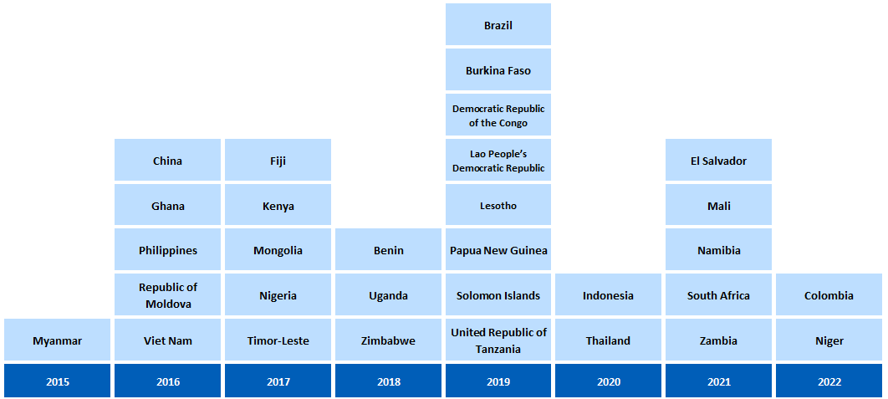

```{r setup, include=FALSE}

# Set chunk options.
# Results "asis" is needed to avoid xtable output being html encoded
# Suppress messages, warnings and also the ## at the beginning of printed text
# Set a default figure width too.

knitr::opts_chunk$set(echo = FALSE,
                      results = "asis",
                      message = FALSE,
                      warning = FALSE,
                      fig.width = 12)


# Load output packages ----
# - - - - - - - - - - - - - - - - - - - - - - - - - - - - - - - - - -
library(ggplot2)
library(dplyr)
library(scales)
library(RColorBrewer)
library(whomap)
library(gtbreport)
library(here)
library(Cairo)
library(cowplot)

library(tidyverse)
library(gt)

library(jsonlite)

# Load R functions ----
# - - - - - - - - - - - - - - - - - - - - - - - - - - - - - - - - - -
source(here("report/functions/html_links.R"))
source(here("report/functions/output_ggplot.R"))

# Get the data sets and computed values/statistics for section 6.1 ----
# - - - - - - - - - - - - - - - - - - - - - - - - - - - - - - - - - - - 
source(here('report/ch5-2_prepare_data.r'))


# Show static chart in addition to Kendo chart?
show_static = F

# Save underlying data files as CSV and charts as PDF files?
pdf_csv_folder = here::here("report/local/figures/ch5.2")
save_csv = TRUE
save_pdf = TRUE
save_cairo = TRUE

# Create the output folder (only if it doesn't yet exist)
dir.create(pdf_csv_folder, showWarnings = FALSE, recursive = TRUE)

```

```{r setup2, include=FALSE}
# Chapter 1
# Set options, load data, utility functions
knitr::opts_chunk$set(echo = FALSE,
                      results = "asis",
                      message = FALSE,
                      warning = FALSE)

```

```{r css_js}
# Add standard stylesheets and javascript to support kendo
cat(writeLines(readLines(here("report/resources/headers.htm"))))
```

# 5.2 Costs faced by TB patients and their households  

<span class="red">**Draft! Prepared `r Sys.Date()` using country-reported data snapshot files from `r format(as.Date(snapshot_date), format="%d %B %Y")`!**</span>

The World Health Organization (WHO) End TB Strategy targets for reductions in tuberculosis (TB) disease burden (incidence and mortality) can only be achieved if everyone with TB is able to access diagnosis and treatment. This is not possible if high costs are a major barrier to health care for people with TB. For this reason, the End TB Strategy includes the target that no TB patients and their households face catastrophic total costs because of TB disease. Total costs are defined as the sum of direct medical expenditures, direct nonmedical expenditures and indirect costs (e.g. income losses). 

WHO has established standard methods for conducting a national survey to assess the direct and indirect costs incurred by people with TB and their households (TB patient cost surveys) (`r ref_lnk("1")`). 
Since 2015, there has been substantial progress in the planning and implementation of national TB patient cost surveys (`r lnk("Fig. 5.2.1")`). In 2023, preparations for a repeat survey were initiated in two countries: Myanmar and Viet Nam.

### `r anch("Fig. 5.2.1")`<span class="red">Fig. 5.2.1</span> National surveys of costs faced by TB patients and their households since 2015: progress and plans^a^ (as of August `r report_year`)

```{r fig_5.2.1,fig.alt="National surveys of costs faced by TB patients and their households since 2016: progress and plans"}

f5.2.1_plot <- f5.2.1_data %>%
  whomap(colours = palatte_fig5.2.1,
         legend.title = "Status",
         na.col = "white", water.col = "white",
#         na.label = "Not planned",
         legend.pos = c(0.14,0.40))

output_ggplot(f5.2.1_plot, f5.2.1_data, show_static = TRUE, pdf_csv_folder, save_csv, save_pdf)

```
<div class="footnote">^a^ A repeat survey is planned in Myanmar and Viet Nam and will be implemented in 2023&#8211;2024.</div>
<div class="footnote">Source: WHO Global Tuberculosis Programme</div>

<hr />
<br />

By August `r report_year`, `r ftb(f5.2.2_txt$all)` countries had completed a survey, including `r ftb(f5.2.2_txt$hbc30)` of the 30 high TB burden countries (`r lnk("Fig. 5.2.2")`). Nine surveys were completed in the period 2020&#8211;2022, during the COVID-19 pandemic. 

### `r anch("Fig. 5.2.2")`<span class="red">Fig. 5.2.2</span> Timeline of national TB patient cost surveys implemented since 2015 (as of August `r report_year`)

```{r fig_5.2.2,fig.alt="Timeline of national TB patient cost surveys implemented since 2015", out.width = '60%'}



```
<div class="footnote">Source: WHO Global Tuberculosis Programme</div>

<hr />
<br />

In the `r nrow(f5.2.3a_txt_num)` surveys for which results have been reported, the percentage of TB patients and their households that experienced catastrophic total costs (defined as >20% of annual household expenditure or income) ranged from `r ftb(f5.2.3a_txt_lo$catast_pct)`% (95% confidence interval [CI]: `r ftb(f5.2.3a_txt_lo$catast_pct_lo)`&#8211;`r ftb(f5.2.3a_txt_lo$catast_pct_hi)`%) in `r f5.2.3a_txt_lo$country` to `r ftb(f5.2.3a_txt_hi$catast_pct)`% (95% CI: `r ftb(f5.2.3a_txt_hi$catast_pct_lo)`&#8211;`r ftb(f5.2.3a_txt_hi$catast_pct_hi)`%) in `r f5.2.3a_txt_hi$country` (`r lnk("Fig. 5.2.3")`). The pooled average for all `r nrow(f5.2.3a_txt_num)` countries, weighted for each country's number of notified cases, was `r ftb(f5.2.3a_txt$catast_pct)`% (95% CI: `r ftb(f5.2.3a_txt$catast_pct_lo)`&#8211;`r ftb(f5.2.3a_txt$catast_pct_hi)`%). Among `r nrow(f5.2.3c_txt_num)` countries that reported disaggregated data, the percentage facing catastrophic total costs was much higher for people with drug-resistant TB, with a pooled average of `r ftb(f5.2.3c_txt$catast_pct)`% (95% CI: `r ftb(f5.2.3c_txt$catast_pct_lo)`&#8211;`r ftb(f5.2.3c_txt$catast_pct_hi)`%).

### <span style="color:#F21905">Fig. 5.2.3</span> Estimates of the percentage of TB patients and their households facing catastrophic costs,^a^ national surveys completed 2015&#8211;`r report_year-1` 

```{r fig_5.2.3,fig.dim = c(12, 16),fig.alt="Forest plot to show selected baseline results from national surveys of costs faced by TB patients and their households"}

f5.2.3a_plot <- 
  f5.2.3a_data  %>% 
  mutate(country = factor(country, levels = f5.2.3_sel_order$country, ordered = TRUE)) %>% 
  ggplot(aes(y = country, x = catast_pct, group=grp))+
  geom_point(aes(col=grp,shape=grp,size=grp))+
  geom_errorbar(aes(xmin=catast_pct_lo, xmax=catast_pct_hi,col=grp), width=0.5,cex=1) +
  xlim(0,100) + xlab(bquote('Percentage')) + ylab(NULL) +
  annotate("text", x = 0, y = nrow(f5.2.3a_data)+1.5, label = "All forms of TB", cex=5,hjust = 0)+
  coord_cartesian(clip = 'off') +
  scale_color_manual(values=c("darkblue","dodgerblue3")) +
  scale_shape_manual(values=c(18,20)) +
  scale_size_manual(values=c(5,4)) +
  theme_gtb() + theme(legend.position = "none") +
  theme(axis.title.x = element_text(face = 'bold',size=12)) +
  theme(axis.text.x  = element_text(face = 'plain',size=12)) +
  theme(axis.text.y  = element_text(face = c('bold',rep('plain',nrow(f5.2.3a_data)-1)),size=12))


f5.2.3b_plot <- 
  f5.2.3b_data  %>% 
  mutate(country = factor(country, levels = f5.2.3_sel_order$country, ordered = TRUE)) %>% 
  ggplot(aes(y = country, x = catast_pct, group=grp))+
  geom_point(aes(col=grp,shape=grp,size=grp))+
  geom_errorbar(aes(xmin=catast_pct_lo, xmax=catast_pct_hi,col=grp), width=0.5,cex=1) +
  geom_text(aes(label="NA",x=96,y=6),vjust=0.5,hjust=-0,col="grey45",size=4)+
  xlim(0,100) + xlab("Percentage") + ylab(NULL) +
  annotate("text", x = 0, y = nrow(f5.2.3b_data)+1.5, label = bquote('TB (first-line treatment)'^'b'), cex=5,hjust = 0)+
  coord_cartesian(clip = 'off') +
  scale_color_manual(values=c("green4","seagreen3")) +
  scale_shape_manual(values=c(18,20)) +
  scale_size_manual(values=c(5,4)) +
  theme_gtb() +
  theme(legend.position = "none") +
  theme(axis.title.x = element_text(face = 'bold',size=12)) +
  theme(axis.text.x  = element_text(face = 'plain',size=12)) +
  theme(axis.text.y  = element_text(face = c('bold',rep('plain',nrow(f5.2.3b_data)-1)),size=12))

f5.2.3c_plot <- 
  f5.2.3c_data  %>% 
  mutate(country = factor(country, levels = f5.2.3_sel_order$country, ordered = TRUE)) %>% 
  ggplot(aes(y = country, x = catast_pct, group=grp))+
  geom_point(aes(col=grp,shape=grp,size=grp))+
  geom_errorbar(aes(xmin=catast_pct_lo, xmax=catast_pct_hi,col=grp), width=0.5,cex=1) +
  geom_text(aes(label="NA",x=96,y=2),vjust=0.5,hjust=-0,col="grey45",size=4)+
  geom_text(aes(label="NA",x=96,y=9),vjust=0.5,hjust=-0,col="grey45",size=4)+
  geom_text(aes(label="NA",x=96,y=28),vjust=0.5,hjust=-0,col="grey45",size=4)+
  geom_text(aes(label="NA",x=96,y=30),vjust=0.5,hjust=-0,col="grey45",size=4)+
  xlim(0,100) + xlab("Percentage") + ylab(NULL) +
  annotate("text", x = 0, y = nrow(f5.2.3c_data)+1.5, label = bquote('Drug-resistant'~'TB'^'b'), cex=5,hjust = 0)+
  coord_cartesian(clip = 'off') +
  scale_color_manual(values=c("firebrick4","firebrick3")) +
  scale_shape_manual(values=c(18,20)) +
  scale_size_manual(values=c(5,4)) +
  theme_gtb() +
  theme(legend.position = "none") +
  theme(axis.title.x = element_text(face = 'bold',size=12)) +
  theme(axis.text.x  = element_text(face = 'plain',size=12)) +
  theme(axis.text.y  = element_text(face = c('bold',rep('plain',nrow(f5.2.3c_data)-1)),size=12))

# aligned_plots <- align_plots(f5.2.3a_plot,f5.2.3b_plot,f5.2.3c_plot, align="hv", axis="tblr") 
f5.2.3_plot <- ggdraw() +
  draw_plot(f5.2.3a_plot, x=0,   y=0.5, width=1, height=0.5) +
  draw_plot(f5.2.3b_plot, x=0,   y=0, width=0.5, height=0.5) +
  draw_plot(f5.2.3c_plot, x=0.5, y=0, width=0.5, height=0.5) 

f5.2.3bc_plot <- plot_grid(f5.2.3b_plot, f5.2.3c_plot)
f5.2.3bc_data <- plyr::rbind.fill(f5.2.3b_data, f5.2.3c_data)

output_ggplot(f5.2.3a_plot, f5.2.3a_data, show_static, pdf_csv_folder, save_csv, save_pdf, save_cairo = T)
output_ggplot(f5.2.3bc_plot, f5.2.3bc_data, show_static, pdf_csv_folder, save_csv, save_pdf, save_cairo = T)

```

<div id="fig_5_2_3a"></div>

<div class="row">
<div class="col-md-6">
<div id="fig_5_2_3b"></div>
</div>
<div class="col-md-6">
<div id="fig_5_2_3c"></div>
</div>
</div>


<div class="footnote">
<!-- NA - not available. -->
^a^ Defined as direct medical expenditures, direct nonmedical expenditures and indirect costs (e.g. income losses) that sum to >20% of annual household expenditure or income. This indicator is not the same as the SDG indicator for catastrophic health expenditures; see <span style="color:#F21905">Box 5</span> of the main report for further explanation.
<br />^b^ Disaggregated estimates for TB (first-line treatment) and drug-resistant TB were available for only `r nrow(f5.2.3c_txt_num)` countries. The calculation of confidence intervals for Mali and Uganda did not account for sampling design.
<br /><br />Source: WHO Global Tuberculosis Programme</div>

<hr />
<br />

The distribution of costs faced by TB patients and their households varied among countries (`r lnk("Fig. 5.2.4")`). However, it was evident that &#8211; despite the widespread norm of "free TB care" policies &#8211; TB-affected households still faced direct medical costs. Such costs accounted for a sizeable proportion (20% or more) of total costs in `r int2word(f5.2.4_txt_med_list)` countries (`r sub("Democratic", "the Democratic", knitr::combine_words(f5.2.4_txt_med$country, oxford_comma=FALSE))`). Minimizing direct medical costs borne by TB patients should be a high priority for national TB programmes (NTPs) and ministries of health.

The surveys also showed that actions are needed to eliminate direct nonmedical costs and to reduce indirect costs. The combined cost of transportation, food, nutritional supplements and other nonmedical expenditures ("direct nonmedical costs") accounted for a substantial share (50% or more) of total costs in `r f5.2.4_txt_nmed_list` countries, including `r gsub("(Philip)|(Democratic)|(United)", "the \\1\\2\\3", knitr::combine_words(f5.2.4_txt_nmed$country, oxford_comma=FALSE))`. 

Indirect costs associated with loss of employment or time lost while seeking or staying in care accounted for the largest single share of total costs in `r f5.2.4_txt_indirect_list` countries: `r gsub("(Philip)|(Democratic)|(Russian)", "the \\1\\2\\3", knitr::combine_words(f5.2.4_txt_indirect$country, oxford_comma=FALSE))`.

All cost categories are influenced by the model of TB care; for example, to what extent there is reliance on hospitalization or outpatient care, the frequency with which attendance at health facilities is requested and the level to which services are decentralized to bring the services close to the community. They are also influenced by ease of access to the health facilities used to provide care.

### <span style="color:#F21905">Fig. 5.2.4</span> Distribution of costs faced by TB patients and their households in national surveys^a^ completed 2015&#8211;`r report_year-1`  

```{r fig_5.2.4,fig.dim = c(12, 9)}

f5.2.4_plot <- f5.2.4_data %>% 
  # pivot_longer(p_med:p_indirect,names_to="cat") %>% 
  mutate(country = factor(country, levels = f5.2.4_sel_order$country, ordered = TRUE)) %>% 
  mutate(cat=factor(cat,levels=c("p_indirect","p_nmed","p_med"))) %>%
  ggplot(aes(fill=cat, y=value, x=country)) + 
  geom_bar(stat="identity", position="fill") +
  scale_fill_manual(name = NULL,
                      labels = c("Indirect","Direct, nonmedical","Direct, medical"),
                      values = palatte_f5.2.4,
                      guide = guide_legend(reverse=TRUE))+
  theme_gtb() + theme(legend.position = "bottom") +
  theme(
    axis.line.y=element_blank(),
    axis.text.y=element_text(size=12,face="plain"))+
  xlab("")+
  scale_y_continuous(name ="Cost breakdown (%)",
                     labels = scales::percent_format(accuracy = 1))+
  coord_flip()

output_ggplot(f5.2.4_plot, f5.2.4_data, show_static, pdf_csv_folder, save_csv, save_pdf)


```
<div id="fig_5_2_4"></div>
<div class="footnote">^a^ The distributions are based on `r nrow(f5.2.4_txt_num)` country surveys that have been completed and the data were reported. Data are not available for Benin.
<br />Source: WHO Global Tuberculosis Programme</div>

<hr />
<br />

In 2023, results from national surveys were used to produce model-based estimates of the percentage of TB patients and their households facing catastrophic costs in all 135 low and middle-income countries (`r ref_lnk("2")`). The model-based estimate for all countries was `r ftb(f5.2.5_txt_global$est)`% (95% CI: `r ftb(f5.2.5_txt_global$est_lo)`&#8211;`r ftb(f5.2.5_txt_global$est_hi)`%). Among the six WHO regions, the highest percentage was in the African Region: `r ftb(f5.2.5_txt_afro$est)`% (95% CI: `r ftb(f5.2.5_txt_afro$est_lo)`&#8211;`r ftb(f5.2.5_txt_afro$est_hi)`%) (`r lnk("Fig. 5.2.5")`). 

### `r anch("Fig. 5.2.5")`<span class="red">Fig. 5.2.5</span> Model-based estimates of the percentage of TB patients and their households facing catastrophic costs in 135 low- and middle-income countries (LMICs), overall and by WHO region
```{r fig_5.2.5, fig.alt="Forest plot showing Model-based estimates of catastrophic costs", fig.asp=0.5}

f5.2.5_plot <- f5.2.5_data %>% 

  ggplot(aes(x=entity,
             y=est)) +
  geom_point(size=4, col = "blueviolet") +


  labs(x="",
       y="Percentage (%)") +
  
  geom_pointrange(aes(ymin=est_lo,
                      ymax=est_hi),
                  size=1, col = "blueviolet") +
  
  expand_limits(y=0) + ylim(0,90) +
  coord_flip() +
  theme_gtb() 
  
output_ggplot(f5.2.5_plot, f5.2.5_data, show_static, pdf_csv_folder, save_csv, save_pdf)

```
<div id="fig_5_2_5"></div>

<hr />
<br />

Social protection is required to mitigate or eliminate direct nonmedical costs and indirect costs. In `r report_year`, `r ftb(t5.2.1_txt1$sp_2023)` of the 30 high TB burden countries reported having a national policy specifically related to social protection for people with TB, up from `r ftb(t5.2.1_txt1$sp_2022)` in `r report_year-1` (`r lnk("Table 5.2.1")`). Free access to TB treatment is the most common measure (all of the `r ftb(t5.2.1_txt1$sp_2023)` countries with a policy related to social protection). In `r ftb(t5.2.1_txt3)` countries, at least one other form of social protection was in place in 2023; examples included cash transfers, enablers to adhere to treatment, and support to help with food security.

### `r anch("Table 5.2.1")`<span class="red">Table 5.2.1</span> Status of social protection for people with TB in `r report_year`, 30 high TB burden countries 
<div class="subhead"><span style="color:#009ADE">**Blue**</span> indicates that a policy or specific measure is in place, <span style="color:#F4A81D">**yellow**</span> indicates that a policy or specific measure is not in place, <span style="color:#666699">**grey**</span> indicates a policy or specific measure has not been identified, and blank indicates that no data were reported.</div> 

<br />
```{r tab_5.2.1}


t5.2.1 <- t5.2.1_data %>%
  gt(rowname_col = "country") |>
  sub_missing(missing_text = "") |>
  cols_label(
    social_protn = html("National policy specifically providing social protection services to people with TB"),
    free_access_tbdx = html("Free access to TB diagnosis"),
    free_access_tbtx = html("Free access to TB treatment"),
    enable_tx_adherence = html("Enablers to adhere to TB treatment"),
    cash_trans = html("Cash transfers<sup>a</sup>"),
    food_security = html("Measures to ensure food security"),
    other_social_protn = html("Targeting")
  ) %>%
  data_color(
    direction = "row",
    palette = c("#F4A81D","#009ADE","grey40"),
    na_color = "white",
    columns = social_protn:food_security
  ) |>
  cols_width(country ~ px(220), social_protn ~ px(130),
             free_access_tbdx:food_security  ~ px(80),
             other_social_protn ~ px(280)) |>
  tab_spanner(
    label = "Type of social protection measures provided to people with TB",
    columns = c(3:8)
  ) %>%
  tab_style(
    style = cell_text(color = "black", weight = "bold",size = 12),
    locations = list(
      cells_column_spanners(everything()),
      cells_column_labels(social_protn)
    )
  ) %>%
  tab_style(
    style = cell_text(color = "black",size = 12),
    locations = list(
      cells_column_labels(free_access_tbdx:other_social_protn)
    )
  ) %>%
  tab_style(
    style = cell_text(size = 0),
    locations = cells_body(
    columns = social_protn:food_security
    )
  ) %>%
  tab_style(
    style = cell_text(size = 12),
    locations = cells_body(
    columns = other_social_protn
    )
  ) 

t5.2.1 <- t5.2.1 %>%
  tab_options(
    column_labels.background.color = "white",
    table.font.size = 12,
    # row_group.border.top.width = px(3),
    row_group.border.top.color = "black",
    row_group.border.bottom.color = "black",
    table_body.vlines.style =  "solid",
    # table_body.vlines.color =  "red",
    table.border.top.color = "black",
    table.border.top.width = px(3),
    table.border.bottom.color = "black",
    table.border.bottom.width = px(2),
    # table_body.border.bottom.width = px(2),
    table_body.border.bottom.color = "black",
    column_labels.border.bottom.color = "black",
    column_labels.border.bottom.width = px(2)
  ) %>%
  tab_options(
    table_body.vlines.color  = "white",
    table_body.hlines.color  = "grey"
  ) 
output_ggplot(t5.2.1, t5.2.1_data, show_static = TRUE, pdf_csv_folder, save_csv, save_pdf=F, save_cairo=F)
```
<div class="footnote">^a^ Cash transfers include conditional and unconditional cash-transfer schemes.
<br />Source: WHO Global Tuberculosis Programme</div>

<hr />
<br />

In addition to protection from catastrophic costs, people with TB need to be protected from stigma and discrimination. Most of the 30 high TB burden countries have policies in place to protect people diagnosed with TB from losing their employment, to protect them from housing eviction, to protect their parental rights over children, to protect them from any compulsory isolation and to ensure that they do not face restrictions in accessing congregate settings (`r lnk("Table 5.2.2")`). However, there are also several high TB burden countries where such protective policies are not yet in place. This includes `r int2word(t5.2.2_txt)` countries where there are no policies to protect rights in any these five domains: `r gsub("(Philip)|(Democratic)|(Russian)", "the \\1\\2\\3", knitr::combine_words(t5.2.2_txt_list$country, oxford_comma=FALSE))`. 

### `r anch("Table 5.2.2")`<span class="red">Table 5.2.2</span> Status of national laws and regulations against stigma and discrimination due to TB, 30 high TB burden countries^a^ 

<br />
```{r tab_5.2.2}

t5.2.2 <- t5.2.2_data2 %>%
  gt(rowname_col = "Type") |>
  sub_missing(missing_text = "") |>
  cols_label(
    Yes = html("A policy or specific measure is in place"),
    No = html("A policy or specific measure is not in place"),
    Unknown = html("A policy or specific measure has not been identified"),
  ) %>%
  tab_style(
    style = list(cell_fill(color = "#009ADE"),
                 cell_text(color = "white", v_align = "top")),
    locations = cells_body(
      columns = c(Yes)
    )
  ) %>%
  tab_style(
    style = list(cell_fill(color = "#F4A81D"),
                 cell_text(color = "white", v_align = "top")),
    locations = cells_body(
      columns = c(No)
    )
  )  %>%
  tab_style(
    style = list(cell_fill(color = "white"),
                 cell_text(color = "black", v_align = "top")),
    locations = cells_body(
      columns = c(Unknown)
    )
  ) %>%
  tab_style(
    style = cell_text(align = "center", v_align = "middle"),
    locations = cells_column_labels(columns = Yes:Unknown)) %>%
  cols_width(Type ~ px(160), 
             Yes  ~ px(450),
             No   ~ px(300),
             Unknown ~ px(180)) |>
  tab_style(
    style = cell_text(color = "black", weight = "bold",size = 12),
    locations = list(
      cells_column_labels(everything())
    ) 
  ) %>%
  tab_style(
    style = cell_text(color = "black", weight = "bold",size = 12),
    locations = cells_stub()
  ) 


t5.2.2 <- t5.2.2 %>%
  tab_options(
    table.font.size = 12,
    # row_group.border.top.width = px(3),
    row_group.border.top.color = "black",
    row_group.border.bottom.color = "black",
    table_body.vlines.style =  "solid",
    # table_body.vlines.color =  "red",
    table.border.top.color = "black",
    table.border.top.width = px(3),
    table.border.bottom.color = "black",
    table.border.bottom.width = px(2),
    # table_body.border.bottom.width = px(2),
    table_body.border.bottom.color = "black",
    column_labels.border.bottom.color = "black",
    column_labels.border.bottom.width = px(2)
  ) %>%
  tab_options(
    table_body.vlines.color  = "white",
    table_body.hlines.color  = "grey"
  ) 

output_ggplot(t5.2.2, t5.2.2_data, show_static = TRUE, pdf_csv_folder, save_csv, save_pdf=F, save_cairo=F)

```
<div class="footnote">^a^ Data are not available for Sierra Leone.</div>
<div class="footnote">^b^ Data are not available for Congo.</div>
<div class="footnote">Source: WHO Global Tuberculosis Programme</div>

<hr />
<br />

Comprehensive documentation about the 20 national surveys of costs faced by TB patients and their households that were completed between 2015 and 2021, which used WHO-recommended methods and for which results have been shared with WHO, is available in a book published by WHO in 2023 (`r ref_lnk("3")`). This includes cross-cutting chapters on methods, results, policy implications and future direction, and profiles for each national survey in a standardized format. The coverage of social protection measures for TB-affected households in these 20 countries is also summarized in Part II of the publication.

Further details about model-based estimates of the percentage of TB patients and their households facing catastrophic costs in low and middle-income countries (LMICs), including country specific details and results disaggregated by drug resistance status and household income quintile, are available in a journal article (`r ref_lnk("2")`). The country-specific estimates for LMICs that have not yet implemented a national survey are also provided in the Global tuberculosis report app. 

Further details about policies to protect people from stigma and discrimination can be found in the WHO global TB database.

`r anch("refs")`

<hr style="border:1px solid gray20">

**References**

1. Tuberculosis patient cost surveys: a handbook. Geneva: World Health Organization; 2017 (https://iris.who.int/handle/10665/259701).

2. Portnoy A, Yamanaka T, Nguhiu P, Nishikiori N, Garcia Baena I, Floyd K, et al. Costs incurred by people receiving tuberculosis treatment in low-income and middle-income countries: a meta-regression analysis. Lancet Glob Health. 2023;11:e1640-e7 (https://pubmed.ncbi.nlm.nih.gov/37734806/).
  
3. National surveys of costs faced by TB patients and their households, 2015&#8211;2021. Geneva: World Health Organization; 2022 (https://iris.who.int/handle/10665/366277).


```{r js_functions}
# Insert javascript file containing common Kendo number formatting functions ----
cat(writeLines(readLines(here("report/resources/gtbr_js.htm"))))
```


<script type="text/javascript">
/* JSON data objects for the figures */

var fig_5_2_3a_data = `r f5.2.3a_data %>% filter(iso3!="AVE") %>% arrange(desc(catast_pct)) %>% add_row() %>% rbind.data.frame(filter(f5.2.3a_data, iso3=="AVE"))  %>% toJSON("rows")`   ;

var fig_5_2_3b_data = `r f5.2.3b_data %>% arrange(desc(factor(country, levels = f5.2.3_sel_order$country, ordered = TRUE)))  %>% filter(iso3!="AVE") %>% add_row() %>% rbind.data.frame(filter(f5.2.3b_data, iso3=="AVE"))  %>% toJSON("rows")`   ;

var fig_5_2_3c_data = `r f5.2.3c_data %>% arrange(desc(factor(country, levels = f5.2.3_sel_order$country, ordered = TRUE)))  %>% filter(iso3!="AVE") %>% add_row() %>% rbind.data.frame(filter(f5.2.3c_data, iso3=="AVE"))  %>% toJSON("rows")`   ;

var fig_5_2_4_data = `r f5.2.4_data %>% pivot_wider(names_from = cat, values_from = value) %>% arrange(desc(p_med)) %>% toJSON("rows")`   ;

var fig_5_2_5_data = `r f5.2.5_data %>% select(!g_whoregion)  %>% toJSON("rows")` ;

</script>

```{js, echo=FALSE}

/* Functions to create the figures */
function createFig_5_2_3(fig_ID, data, color, title) {
   
		$(fig_ID).kendoChart({
			dataSource: data,
			chartArea: {
				height: 900
			},	
			title: {
				text: title,
				color: "black",
				font: "bold 16px  Arial,Helvetica,sans-serif",
        align: "left"
			},	
			legend: {
				position: "bottom"
			},
			series: [{
        type: "bar",
				field: 0,
				opacity: 0
			}, {
        type: "line",
				field: "catast_pct",
        errorLowField: "catast_pct_lo",
        errorHighField: "catast_pct_hi",
        errorBars: {color: color, line: { width: 3 }},
        opacity: 0,
				color: color,
        markers: {
          visible: true,
          background: color,
          size: 10
        },
        
			tooltip: {
				visible: true,
        background: color,
				template: "#= category #: #= tb_format_pct(value)#%"
			}
			},{
				type: "rangeArea",
				fromField: "catast_pct_lo",
				toField: "catast_pct_hi",
				opacity: 0,
        color: color,
				tooltip: {
					visible: true,
          background: color,
				format: "{0}",
				template: "95% confidence interval (#= category #): #= tb_format_pct(value.from) #\u2013#= tb_format_pct(value.to) #%"
				}
			}
              ],
			valueAxis: {
				labels: {
					format: "{0}"
				},
				title: {
					text: "Percentage (%)"
				},
				line: {
					visible: false
				},
        min: 0,
        max: 100,
        majorUnit: 25,
			},
			categoryAxis: {
				field: "country",
				labels: {
					rotation: "auto"
				},
				majorGridLines: {
					visible: true
				}
			}

		});
}


function createFig_5_2_4(fig_ID, data, y_axis_title_text) {
		$(fig_ID).kendoChart({
			dataSource: data,
			chartArea: {
				height: 900
			},	
			legend: {
				position: "bottom"
			},
			seriesDefaults: {
				type: "bar",
        stack: true,
        gap: 0.2
			},
			series: [{
        name: "Direct medical",
				field: "p_med",
				color: "darkblue",
        tooltip: {
				visible: true,
				template: "Direct medical (#= category #): #= value.toPrecision(2) #%"
			}
			},{
        name: "Direct nonmedical",
				field: "p_nmed",
				color: "dodgerblue",
        tooltip: {
				visible: true,
				template: "Direct nonmedical (#= category #): #= value.toPrecision(2) #%"
			}
			},{
        name: "Indirect",
				field: "p_indirect",
				color: "goldenrod",
        tooltip: {
				visible: true,
				template: "Indirect (#= category #): #= value.toPrecision(2) #%"
			}
			},
              ],
			valueAxis: {

				title: {
					text: "Cost breakdown (%)"
				},
				line: {
					visible: false
				},
        min: 0,
        max: 100
			},
			categoryAxis: {
				field: "country",
				title: {
					text: y_axis_title_text
				},
				labels: {
					rotation: 0
				},
				majorGridLines: {
					visible: false
				}
        }
		});
}

function createFig_5_2_5(fig_ID, data, color) {
   
		$(fig_ID).kendoChart({
			dataSource: data,
			chartArea: {
				height: 450
			},	
			legend: {
				position: "bottom"
			},
			series: [{
        type: "bar",
				field: 0,
				opacity: 0
			}, {
        type: "line",
				field: "est",
        errorLowField: "est_lo",
        errorHighField: "est_hi",
        errorBars: {color: color, line: { width: 3 }},
        opacity: 0,
				color: color,
        markers: {
          visible: true,
          background: color,
          size: 10
        },
			tooltip: {
				visible: true,
        background: color,
				template: "#= category #: #= value.toPrecision(2) #%"
			}
			},{
				type: "rangeArea",
				fromField: "est_lo",
				toField: "est_hi",
				opacity: 0,
        color: color,
				tooltip: {
					visible: true,
          background: color,
				format: "{0}",
				template: "#= category # (95% confidence interval): #= value.from.toPrecision(2) #\u2013#= value.to.toPrecision(2) #%"
				}
			},
              ],
			valueAxis: {
				labels: {
					format: "{0}"
				},
				title: {
					text: "Percentage (%)"
				},
				line: {
					visible: false
				},
        min: 0,
        max: 100
			},
			categoryAxis: {
				field: "entity",
				labels: {
					rotation: "auto"
				},
				majorGridLines: {
					visible: true
				}
			}

		});
}


```

```{js, echo=FALSE}

/* Create the figures after the document has been loaded */

$(document).ready(function () {
  createFig_5_2_3("#fig_5_2_3a",fig_5_2_3a_data,"dodgerblue","All TB");
  createFig_5_2_3("#fig_5_2_3b",fig_5_2_3b_data,"green","TB (first-line treatment)\u1d47");
  createFig_5_2_3("#fig_5_2_3c",fig_5_2_3c_data,"firebrick","Drug-resistant TB\u1d47");
  createFig_5_2_4("#fig_5_2_4",fig_5_2_4_data,"");
  createFig_5_2_5("#fig_5_2_5",fig_5_2_5_data,"blueviolet");

 });  


```
